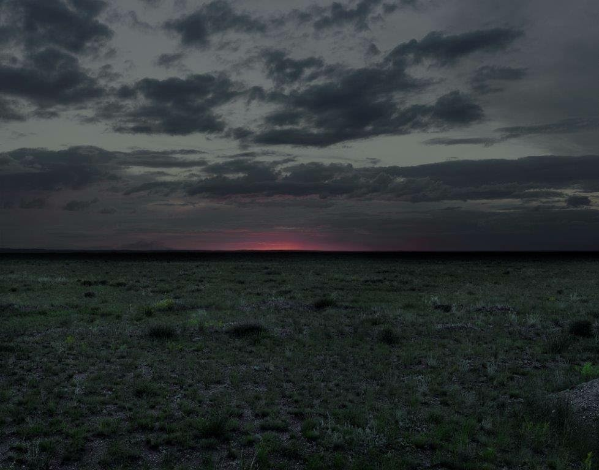
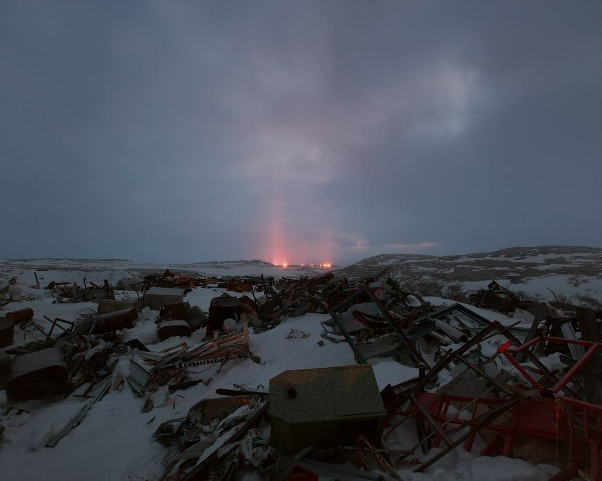
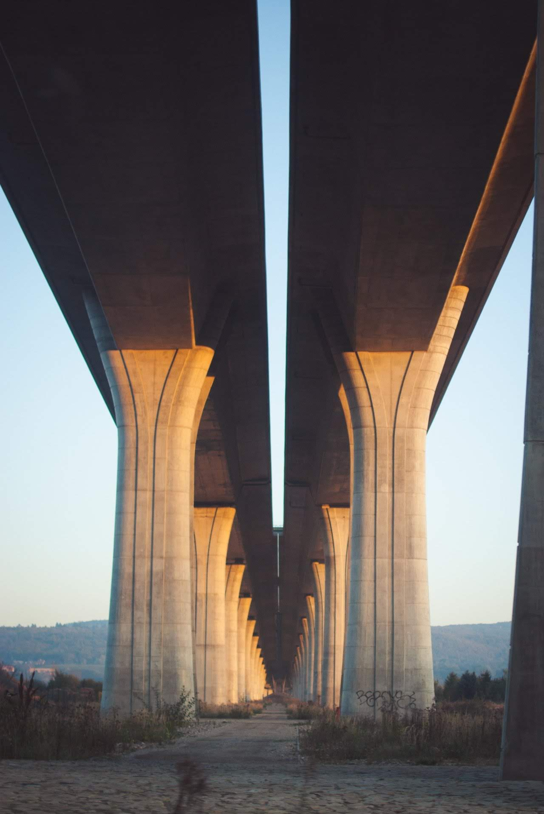
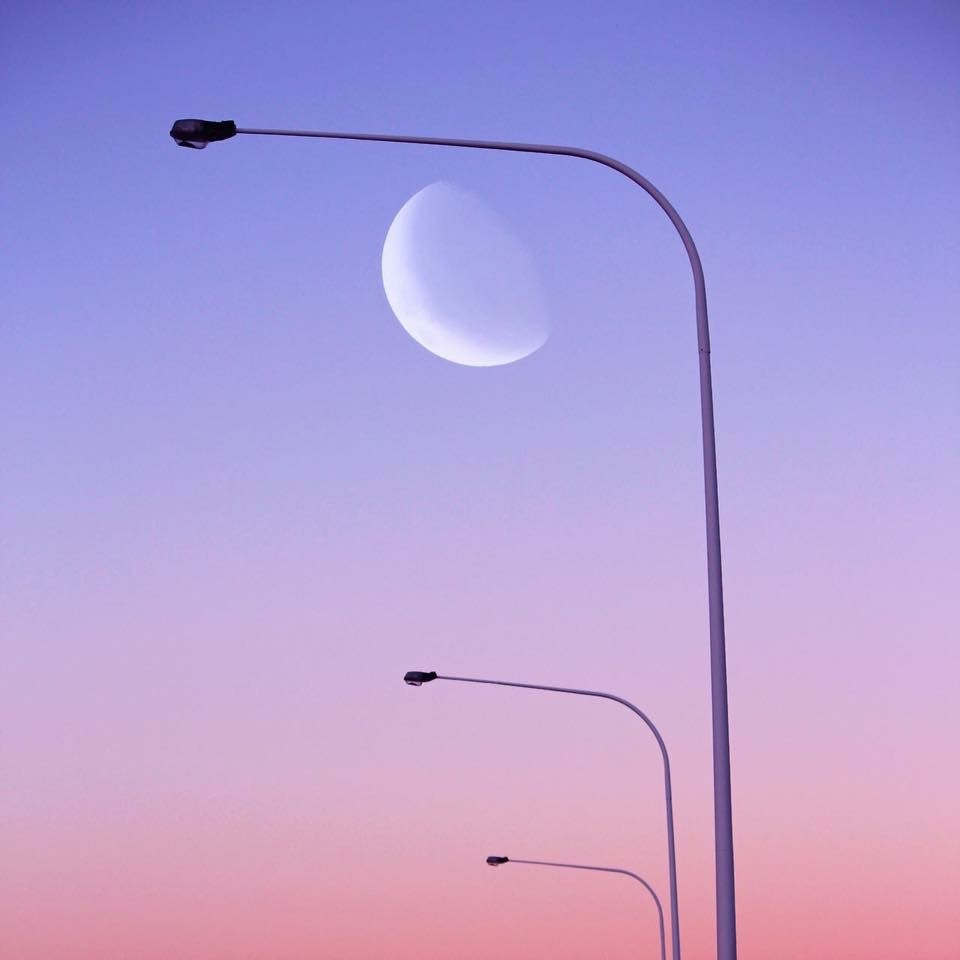
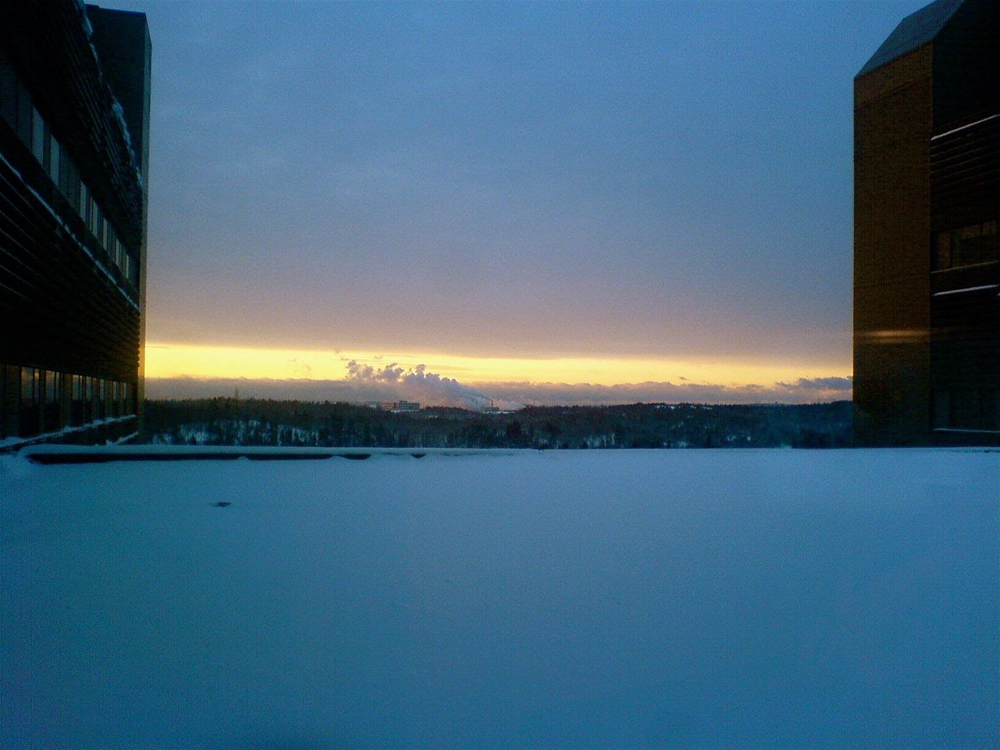
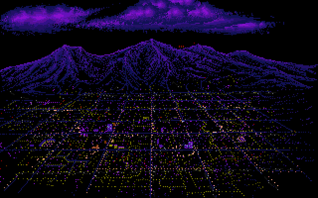
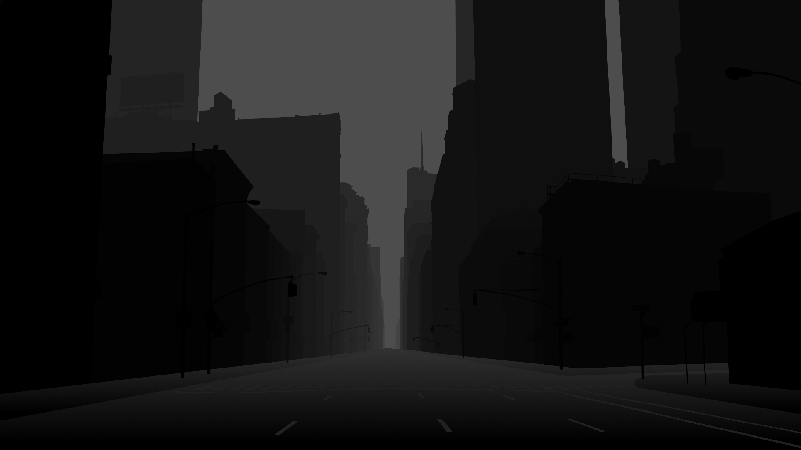

Outskirts of [the city.](/p/10e73639c05f4ed1bc3262e2e8d8296c)

Outer City

Basically a massive [potemkin village](https://en.wikipedia.org/wiki/Potemkin_village).

Designed to be seen from the capital

Like walking around low [LOD textures.](/p/b03950caf703402694b38a73d957ded8) Carboard with false lights. But it's huge. A megalopolis.

Lights hooked up inside paper windows. But people live there nevertheless, in a corner, on some cardboard on the floor.

They go through the motions of work and life.

I imagine yellow wires leading to lights.

Stuff painted over windows.

[Citizens](/p/d7ca438af1474c278031d0c9dd870c42) pretending to live there.

At dusk and dawn, the city fills with people.

**Far Outskirts:**

***

**First signs of civilization:**

***

**Closer**

You can travel on these superhighways on the way back.
