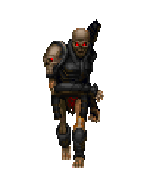

Princes of [the Empire](/p/d85eed9c903b45ae80d803c44ba66be5)

Skeleton princes with shining demonic eyes, huge capes, and miniguns. Kind of like **mini-bosses**.

They had been great kings before the lion killed them.

Like OG doom revenants, but with capes and miniguns instead of cannons.

All have their own dialogue. There are 7 of them (maybe 6)

**Asher**: minigun shoots incendiary bullets which burst and leave patches of fire.

**\[unnamed]**: burning bright white eyes that sweep through the map and turn things to wireframe (symbolizing how he can see)… He can shoot through them (AP bullets)
Whispers messed up things about your story so far… he knows it all.

**Gnomon**: Has some control of time. Can freeze the player in a block of time in which years pass instantly. Anyone caught in the time cube turns into a skeleton, then dust.

**Set**: Master of [Burden Devils](/p/fb05d3b72660433c813da8e52d9a4ae3)

[Forget and Memory](/p/5f79ffa0f5b94b64914725d34ecd2c77). One of them (Lethe) is not in the game, the other is (Mneme). After the game we tell people that he was in the game, but you forgot about him...

All have crowns.

!\[ZDoom • View topic - [SPRITES\] Spriti](../resources/2162f74a329ea86f3d901d19b744ea22.gif)[ng Carnival!!](../resources/2162f74a329ea86f3d901d19b744ea22.gif)

