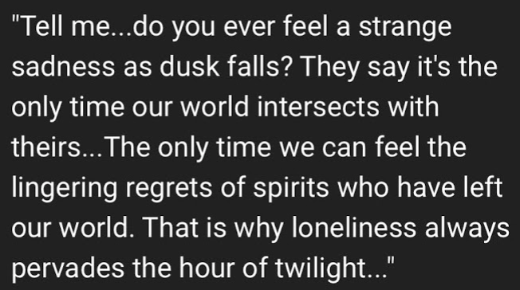

"Tell me... do you ever feel a strange sadness as dusk falls? They say it's the only time our world intersects with theirs... the only time we can feel the lingering regrets of spirits who have left our world. That is why loneliness always pervades the hour of twilight."

The dusk catches the palest [shadows](/p/da622103663d4fad8372a8769414cc25) and makes them shine like god rays or motes of dust in a sunbeam. This is why at dawn or dusk you see so many of them, [the place](/p/10e73639c05f4ed1bc3262e2e8d8296c) the place looks like a real city, the world looks like a real world.
