The City

The only way into the city is through “**the labyrinth of lost dreams.**”

A labyrinthine place. The Lion’s palace is in the center. You need [Liberty](/p/f92b3507b1bf46cc81c6c04fb40efa41) to show you the way.

The main [Starbus](/p/e91ff4dce0f8469b803a6d314663f59c) port is destroyed and was never repaired (why?), so you have to access the one which is in a less populous area, miles from the city.

*The streets are covered with money, as abundant as trash which the wind blows around aimlessly.*

Marked pedestrian routes on the ground. Different colored lines for different castes/occupational groups. Highly organized, but no longer functioning

When you first enter the city, it is dusk. At dusk, the city returns to some semblance of its former life. There is a *tenderness* to the evening light which allows you to see the [shades](/p/da622103663d4fad8372a8769414cc25) which at all other times are too dim to perceive. They carry the past within them. At once the city appears populous. This effect also obtains at great distances. But [when you draw closer, they disappear.](/p/b03950caf703402694b38a73d957ded8)

Photos of the Imperial City:

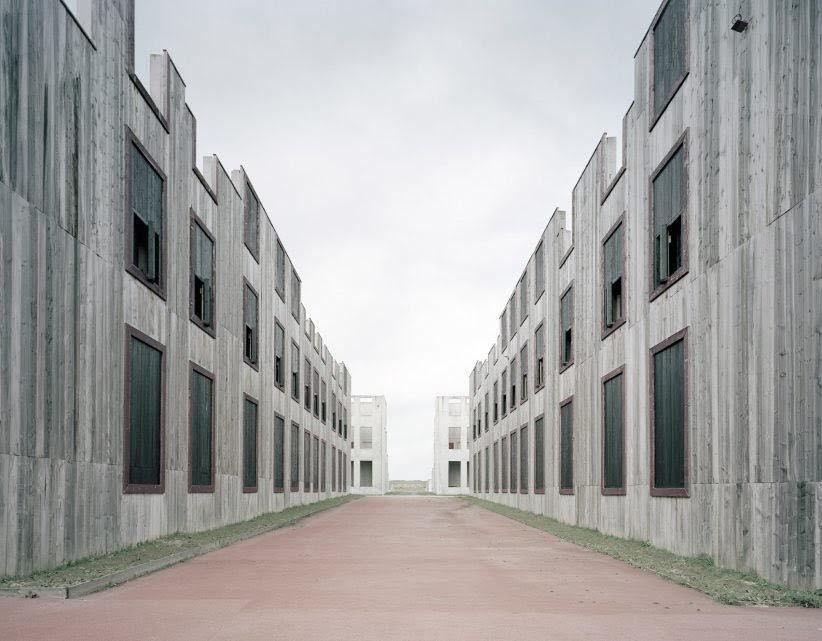

Outer districts (old city):

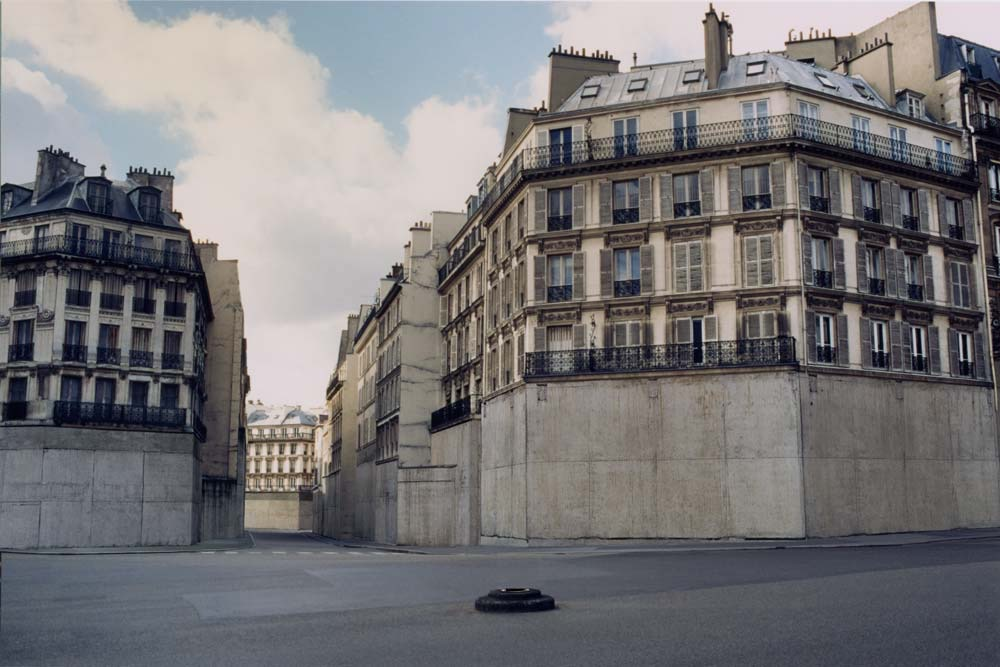 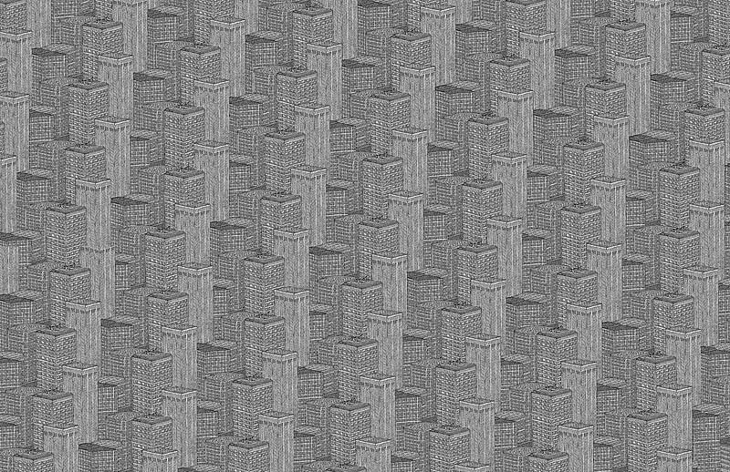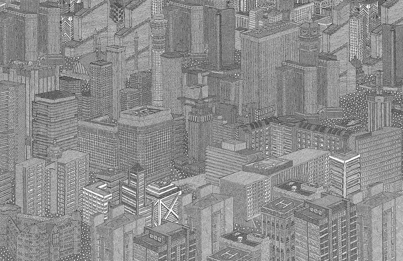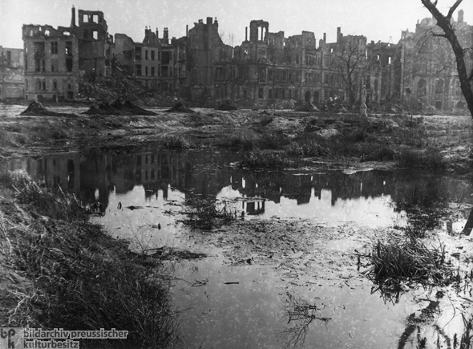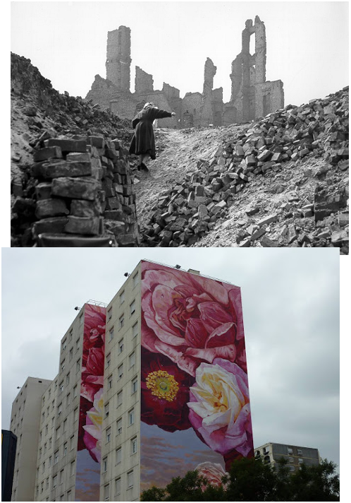

Populated by many of [Liberty](/p/f92b3507b1bf46cc81c6c04fb40efa41)’s sisters, who have fallen asleep.

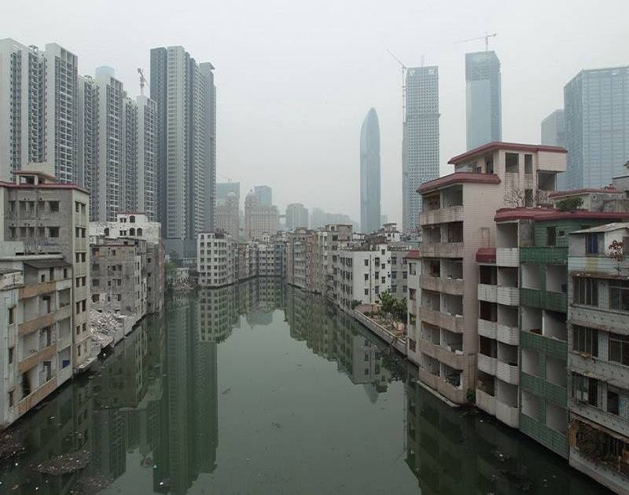

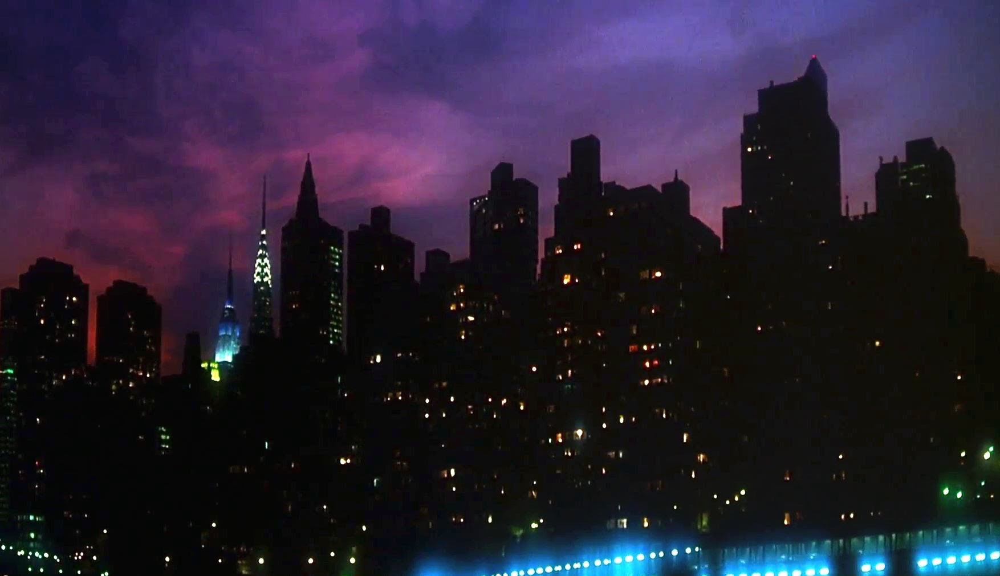

More inspiration… like that giant city in the magician’s nephew. That vast, ruined, grey world. 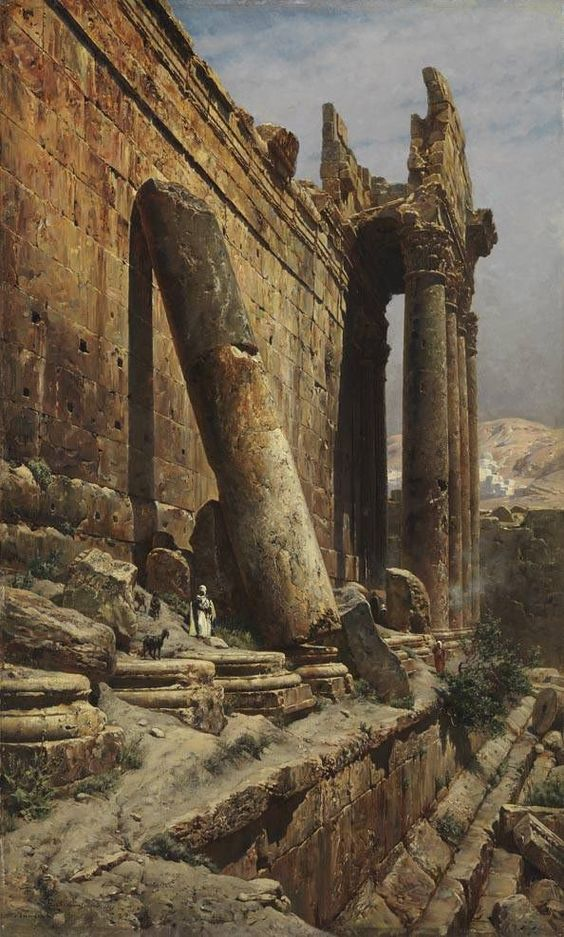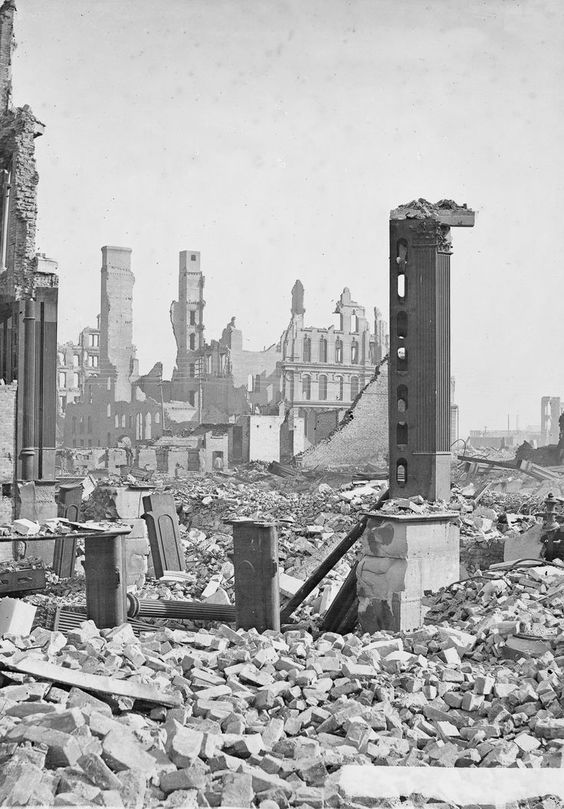

Monumental devastation

You approach the ruins from 50 miles out. That is where the rubble begins.

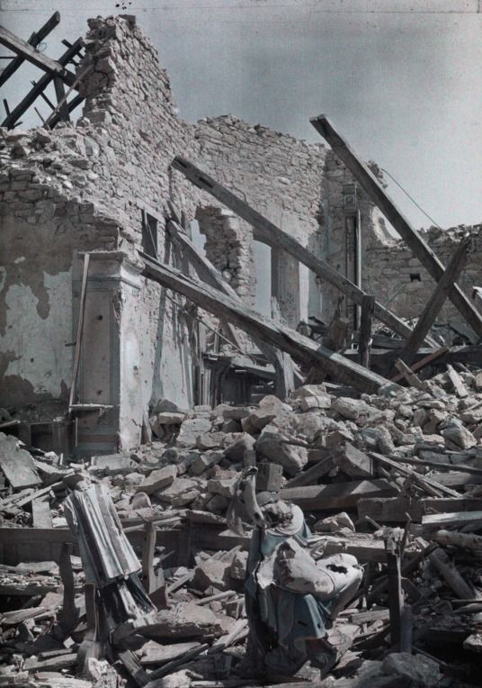 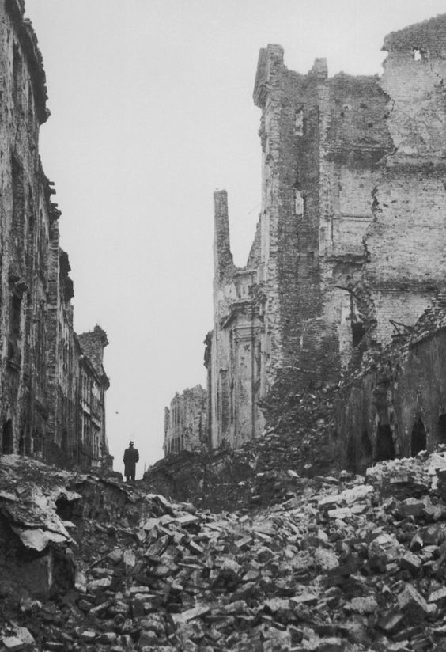

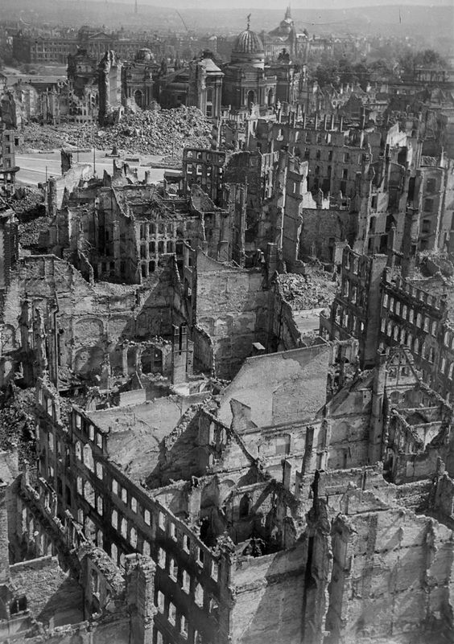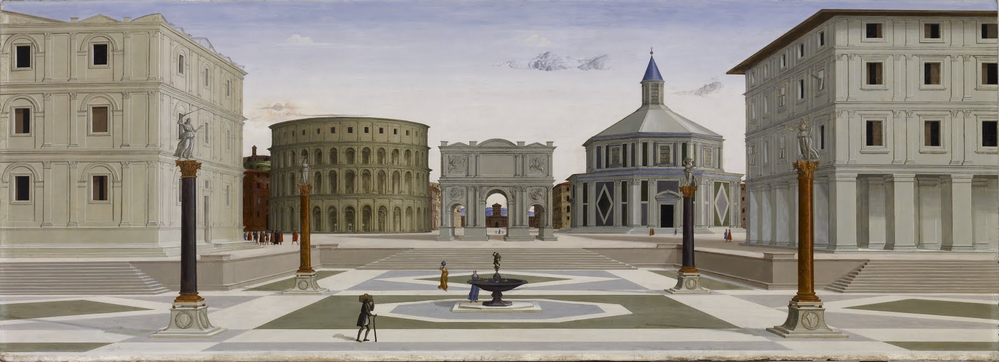

\*When you first enter the city, you meet [Liberty](/p/f92b3507b1bf46cc81c6c04fb40efa41) on a pediment. But next to her there is an empty pediment, marked  "[Justice](/p/fe6019bf0f1f40eb990fb3fc1da2494f)"

## References

[Starbus](/p/e91ff4dce0f8469b803a6d314663f59c)
[Story Roadmap (with scenes)](/p/64c71b1bfb2a4717a53593ce05b258f8)
[The Fireplace](/p/886d0805be5c42acaf8a7247c1303d0e)
[Liberty](/p/f92b3507b1bf46cc81c6c04fb40efa41)
[Outskirts](/p/092136e62d3346eb8eac716f912b06c2)
[Old Summary](/p/355f63b2b1c84813a1b2eb2bbb2cf2bc)
