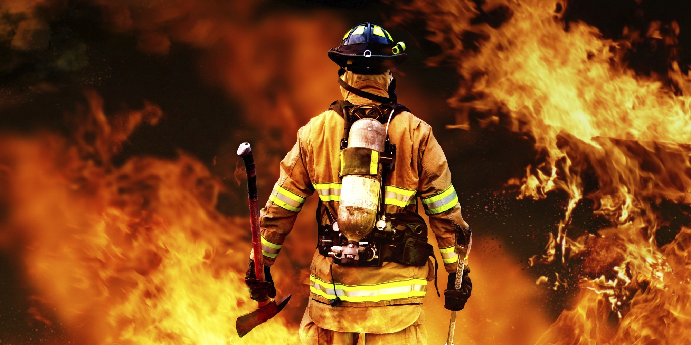

Fire Chief

One who continually burns.
Dresses like a fireman but is constantly on fire. Trailing clouds of thick black smoke. Has a fire axe.
When he rings the fire bell, spawns hundreds of [Firemen](/p/d5993f84a4d64966b451ad2d93de1693), beings of pure flame. Their cries sound like distorted fire sirens…

[Noon time fire siren in Hawleyville](https://youtu.be/PXtqK-mwyW0)

They have hoses which shoot fire.

 

Lives in the [fireplace](/p/886d0805be5c42acaf8a7247c1303d0e).
