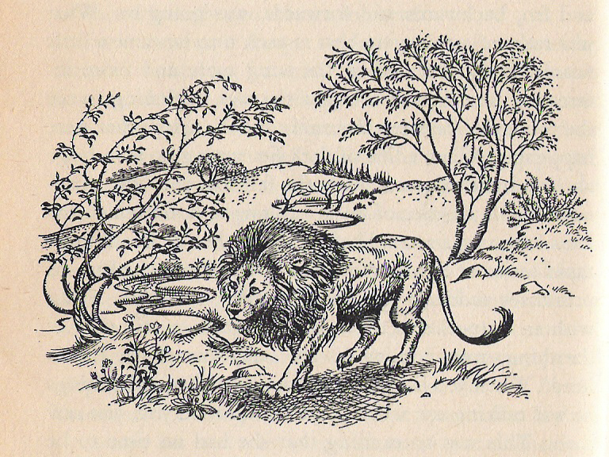

# Lion **(Main Antagonist/Final Boss)**

Lion:
An enormous white lion with a black star around his right eye.
One of the guardians.
Every footsoldier in the galaxy is imprinted with the golden stamp of his authority. Devours pure hearted girls. Seeks out Lucy for the sweetness of a princess, for the taste.
Literally an enormous Lion.
Believes that he is the hero spoken of in the legend. Primal people’s prophecy constructed by advanced calculations. Self-aggrandizing.
Parades held for the world-hero, books of parables & propaganda created for his self-aggrandizement.
“The ancient prophecies speak of a terrible, bloodthirsty monster with whom the world-hero must struggle and ultimately triumph against.”
“You fit the description perfectly. You’re not a human being. You’re something else. You’re a monster. A insurgent. A parricide. A usurper against the divine will. Though you have killed so many of my lieutenants—I’m not afraid. I know that destiny will preserve me.”

He thinks he will triumph. Then he laughs when the 2nd half of the prophecy is revealed…

Engaged in a mega-depopulation campaign of the world… sequesters the echoes so he can find one that can sing.
Wears a key around his neck. [The key to heaven’s door.](/p/b416261f502a4586ad3f4dc1353346e7).
When he’s on the brink of defeat, he transforms into a cat and releases boxes of thousands of cats from the walls, and tries to lose himself in the crowd.
Lucy: Sunset! The key!
Have to find the cat with the key around its neck before he gets away.
Transforms into a brazen tabby.
This is a throwback to the Lion’s *backstory:*
He was a pet of the primal people, then one day he took one of their amulets in his teeth and ran away. This is echoed in his escape scene. It’s his true nature.

***

No, he was always their pet. Scared away by [Sparky](/p/fd7c6445c03847a7b7d35c7e64bc1320), who survives only because of his own naivete and stupidity

“I had to make you suffer, so that you had a reason to kill me. I’m sorry that it had to be this way. Thank you for giving my life meaning. I love you. Goodbye…”“Sunset, I wish I understood you. I wish I understood myself. Why did we come all this way? So one of us could die, and the other could live? I don’t want to die. Do you?”

Cover story (to hide his true intentions from the [Magicians](/p/e3ff55f45f0143ebac643c1cc37813a3)):

Millions of years of ruling the world has made him into a libertine… He has a taste for princesses. After all, despite his pomp and grandeur, he’s essentially only an animal and subsists mostly on animal pleasures. The more mordant a princess’ grief, the sweeter she tastes, kind of like a delicacy. Because Luciferna isn’t even a real princess, her grief is deeper than anyone else and he imprisons her soon after the PC comes to like her in his private reserve. The time clock for the player’s mission is the great self-congratulatory world-conquering anniversary ball that the Lion will hold with all the other monsters of the world, where he will chop her up and serve her like an delicacy to all his warlords.

The lion pretends to be a cannibal libertine to cover his real goal: Yesterday.

**Real story:**

It’s written elsewhere, but the lion is trying to return the world to lost paradise. Even if he will be the only one who gets to enjoy it. By whim he goes to the imperial library and remembers… **something** makes him remember. So under the pretext of the [Citizens’](/p/d7ca438af1474c278031d0c9dd870c42) complaints, he hurriedly orders the [Depopulation Teams](/p/56cb1fe4b44c40209f6739ce34830eb8) to gather up all the [shadows](/p/da622103663d4fad8372a8769414cc25) on the [Prison Planet](/p/fde64cac01824d63a685fa2cd4695b38). Where he can look through each one to see if they are the ones whom he remembers. Interconscious recognition (looking into someone’s eyes) sparks an [activation](/p/6186266638ff44bc9fa48d3cb912f53b).

The Lion remembers that the surveyor had a theodolite. What, then, is [Sunset](/p/e86dde5ef894493cb5e1f93855b62c83)? He is the [the Monster Who Devours the World](/p/03ed3db7a132404dbc0c094de353e46c), from the ancient prophecy.

At least Lion thinks this is so… in the end, it turns out that he’s right. Although midway you think that Lion is the Monster.

Or maybe Lion thinks that HE is the monster, but he pretends that he thinks that **you** are the monster. Then he reveals himself but he is surprised to find you really *are* the monster. Wow.

Lion: You are the one spoken of in the prophecy. The monster who shall devour the world. He shall conquer all men. But a great one will come and counter him. The prophecy does not say if he triumphs. But I will make it so. I shape my own destiny.
Lion (inwardly): He is the great one who is called. I must destroy him, so I can devour the world and return it to lost eden.

Maybe in the middle of this the second scrap of prophecy is revealed. The monster shall triumph. Thus Sunset has to go against impossible odds.

Lion: The prophet speaks. It is a good time for me to tell you. I am the monster who shall devour the world. You are the great one who shall rise up against me. But who shall triumph?

[Lucy](/p/dc866b99f5794c99874dbaae8479870f) is the battery, the theodolite is the instrument. Sunset is the monster. Yet what kind of monster. He is the one bound to reset the world.

# Symbol

A white star. Maybe **inverted**.

# History

One of the most ancient creatures. Synthesized by [the Surveyor](/p/c7964e9075b3441eb4bd789fd283aa6a).

Very heartsick to return to being with him.

He was the Surveyor’s pet, used to fight anything that his master found while exploring and charting the universe.

This accounts for his great power.

# Meaning

He stands for nostalgia… the selfishness of hopeless nostalgia. He wishes to return to the surveyor, but he wishes to do so alone. Not through collective action or growth, but through sheer atavism.

***

Lion
Equivalent of a kitten… little white cat
Enemy stuff on the enemy page.

# Motivation

## Wants:

To go [Home](/p/a20eec20a73b4baf90f96bd591b6d7ee).

## Doesn't Want:

To trigger [the Prophecy of the Monster Who Devours the World](/p/03ed3db7a132404dbc0c094de353e46c)

## References

[The Lion's Home](/p/2ba18aefabb84a348add14a36c1d3714)
[The Lonely](/p/2e52e2f53aea40569e46d4db26a5cb37)
[The Prophecy of the Monster Who Devours the World](/p/03ed3db7a132404dbc0c094de353e46c)
[TODO List (SOS)](/p/4742b7c786aa444fb1e01144c78d2890)
[General Design 2](/p/c8a352d4082d4ba4b226d33f9d6c1ea5)
[Imperial Hierarchy](/p/d85eed9c903b45ae80d803c44ba66be5)
[The Air Protocol](/p/39af5dfd7ca34fd2ad511129944e10c9)
[Another Synopsis (top-down) \[best\]](/p/735c96da2df5451eb19b2b2a6b342e74)
[Synopsis (another one)](/p/21d29c8fa11c46c3aeb6b26c29a1505e)
[Word List / Categories](/p/193c4b3e6ea24170829178087aec70c1)
[Signs](/p/51a96d9178ab4a72ba6384a7f3faa7e6)
[The Surveyor](/p/c7964e9075b3441eb4bd789fd283aa6a)
[Thematic Summary](/p/e45d131cc99241dbba77cd9ac03e4f75)
[Dialogue (with an imagined person who doesn’t know anything about the game)](/p/27f1c4cd3bde4451bed14fb5862f31a7)
[Permanence and Loss (playthroughs)](/p/1685a994ac7b4f0f9d79cad42388e2a4)
[Obnoxious Questions (used to flesh out the game) Annoying Questions FAQ](/p/0b6fa809714a4d62bc688da4979df27b)
[Old Summary](/p/355f63b2b1c84813a1b2eb2bbb2cf2bc)
[Story Thematics (Fairy Tale) (top-down)](/p/7e46cce45f5344249c6c2881b168e2ab)
[Attempts at an Elevator Pitch](/p/7712c363399c404b93897ad56e4418bc)
