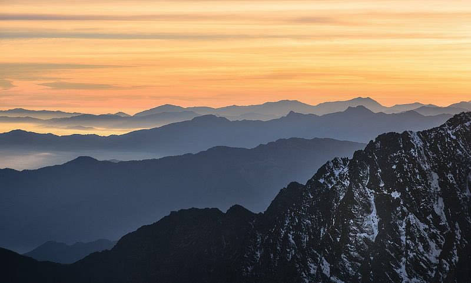
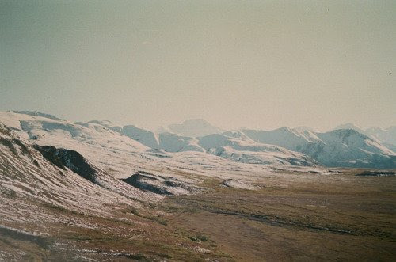
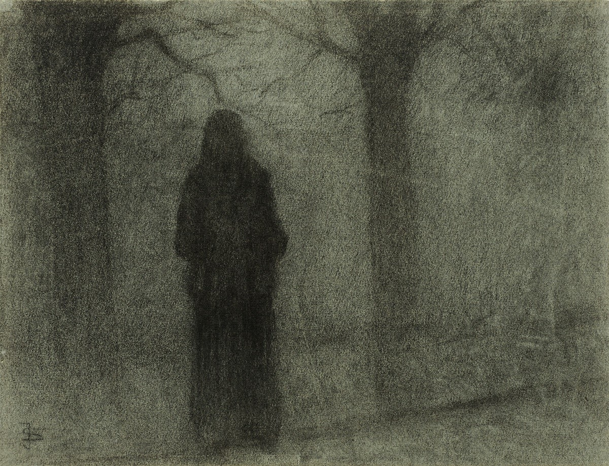
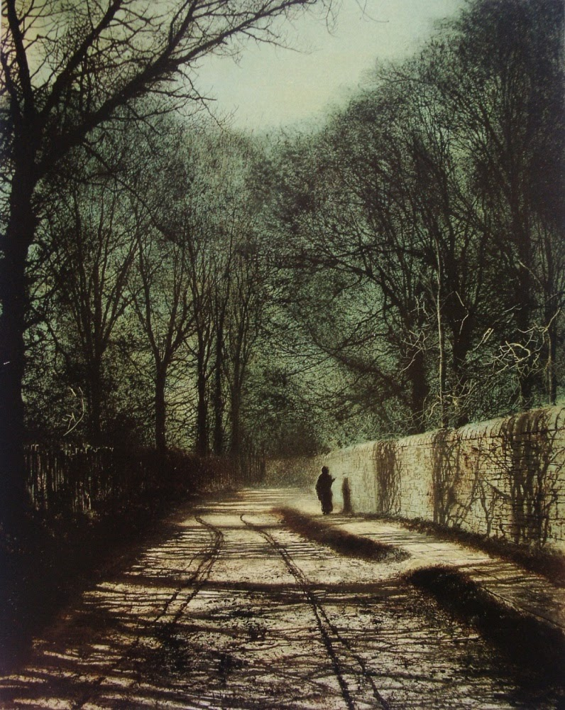

Frozen Planet.

Like a giant recycle bin.

This is where [Lion](/p/2001b9b679ed4d8abbd8cfb46998773c) discards/exiles [the Weatherman](/p/626c245aa9f84338bbd35a3874186b8a).

Later he leaves [Sunset](/p/e86dde5ef894493cb5e1f93855b62c83) there.

What else could be here?

[Crackle](/p/a83ed73098c5416684c4c5d4097e32dc)

What is excluded from a civilization like this?

Extremes both of hatred and of joy, of good and evil.

Sunset is unconscious of an internal joy.

You have almost the only technology on the whole planet, so the weatherman has to stay with you.

Console/Consul

Is it just an icy tundra? Maybe they leave you there and detonate the Starbus Station. Leaving you without hope.

**Note:** does it make sense to have the Weatherman here? Seems like there’s no technology to possess. Maybe Sunset’s HUD.

Yes. He *follows* you to the main city and starts messing with it, particularly after Lion disables the air protocol.

***

# Background and More Info

This is an extremely remote sector. Where everything in the universe goes to be forgotten, and disappears.

People have forgotten its name, so [Lion](/p/2001b9b679ed4d8abbd8cfb46998773c) just calls it "the Lonely."

It is the most remote listed station in the [Starbus](/p/e91ff4dce0f8469b803a6d314663f59c) system.

Lion drops you off there and detonates the station.

The most pure "wilderness" area in the entire game.

The air protocol repels [Crackle](/p/a83ed73098c5416684c4c5d4097e32dc), the cursed creature.

It's a bit like the [Goblin puzzle](https://www.youtube.com/watch?v=V0V3LMK40iI).

Maybe the starbus station detonates and there's a line of lone Air protocol power line stations surrounding it. The last survivors which haven't sunk into the desert. And these bar crackle from eating you. Or maybe there's a single telephone line which creates a radius which bars him. There's also a fossilized [Glass Dog](/p/bfaa1e1d9187463ba1186d4010048e93) that was formerly tending to the station, until it ran out. This last station. The glass dog clung to it... faithful to the end.

[The Weatherman](/p/626c245aa9f84338bbd35a3874186b8a) coaches you on how to run in a circle such that you can escape Crackle. Maybe it's easier, cause he's slower than you. And then once you get out, you run like hell..

~~As he gets closer, you can hear him slavering... you have to run for a while until he's far enough away. Maybe there's a regular transit system, a normal train. You get on this one and slam it shut, just in time for him to press against the glass. The train departs and he leaves you be.... for now.~~

Actually what is better is if you just run into the wilderness. But how far can you really go? Maybe it fades to black and you just "autorun" or something. That would be an interesting system. [Super Autorun](/p/70627be520ac4c0eaca9c70527ce7708)

On the other side of the planet, there's a very old [Starbus](/p/e91ff4dce0f8469b803a6d314663f59c) station which hasn't been detonated.

It's for freight traffic. Kind of like a truck stop, for travelers to cool their engines and refuel.

It's a secret station that only the Weatherman knows about.

You can go from there to the main line. But you have to somehow outrun or kill Crackle. And you have no weapons...

If you kill him, it's a mercy killing... the Weatherman explains all this to you. He's like a genie freed from his bottle.

***

Through it all you are stalked/haunted by the [Crackle](/p/a83ed73098c5416684c4c5d4097e32dc).

