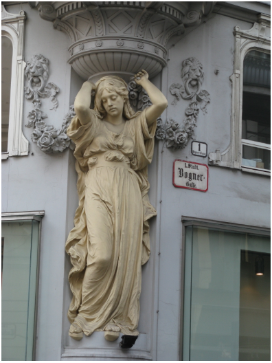

Game Ending:

 |

Lion’s last words:
“Thank you… for giving my life purpose. I love you.”
The Lion dies in your arms, bleeding from its mouth between the gates of sunset at dusk at [The End/Nowhere](/p/a2ad74c520014a0c8070f22f5930797d)

In the endgame, with the angels by his side (as he still has the key to heaven’s door), the Lion hastens to heaven’s door, where the prophecy reads that hero will defeat the villain and open the road to heaven.

***

Hardest part of the game. No weapons? Have to fight mega devils and finally the lion.

The lion defeats you but does not kill you. He finds the fragments of the [Theodolite](/p/dacfbbf983bc428483bfc033e194a678). It is destroyed. In rage, he decides the second best thing is to destroy the universe by killing Lucy and releasing that energy.

But then [the Surveyor](/p/c7964e9075b3441eb4bd789fd283aa6a) appears. But he is just a hologram. His last message.

S: “I know you found [that book](/p/96f5dcec0cba496fafc1e25040a57b07). That’s the last message I have.” He looks at Sunset. “Ask her to fix the world. As much as she can.”

S: “If she’s with you, she can do anything.”

S: “Holding on is hard. But not as hard as letting go. Let go.”

***

OR Lucy decides she would rather be with Sunset and make a new future than go home. It is her decision. The yes which overcomes all evil.

I feel like I haven't nailed it yet.
