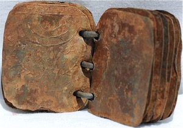

It is an ancient galactic Atlas. [Lucy](/p/dc866b99f5794c99874dbaae8479870f) is much older than most [shades/echoes/ghosts/shards](/p/da622103663d4fad8372a8769414cc25) (Sunset is as well). This is why she needs to look at it.

It is located under a plexiglass/glass frame which is broken. She reads from the plexiglass case that it is the legendary atlas, compiled by [the Surveyor](/p/c7964e9075b3441eb4bd789fd283aa6a).

It is an index of all worlds, and the **song** which corresponds to each one.

Because of her nature (she was a battery for [the Surveyor](/p/c7964e9075b3441eb4bd789fd283aa6a), powering the [Theodolite](/p/dacfbbf983bc428483bfc033e194a678)), she feels a strange affinity with this ancient book.

It is located in the center of [the Library](/p/2027d68ffecb47449da8062236a6f303). It is located in the center in the middle of a bridge which spans the dark river (flowing in silence).

There is a spotlight on it from above.

Lucy reads it and is dissatisfied when she sees that there is an red X through her home planet. More importantly, the coordinates have been scratched out.

She is saved from this aporia by the [Lion](/p/2001b9b679ed4d8abbd8cfb46998773c) finding her. And also just a little before that by finding [The End](/p/96f5dcec0cba496fafc1e25040a57b07).
