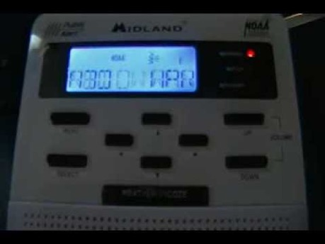
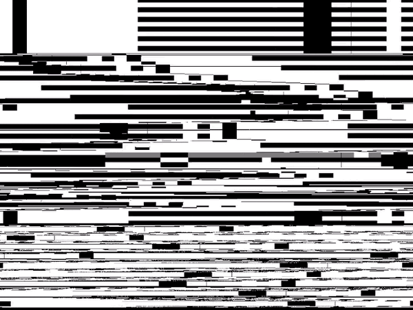
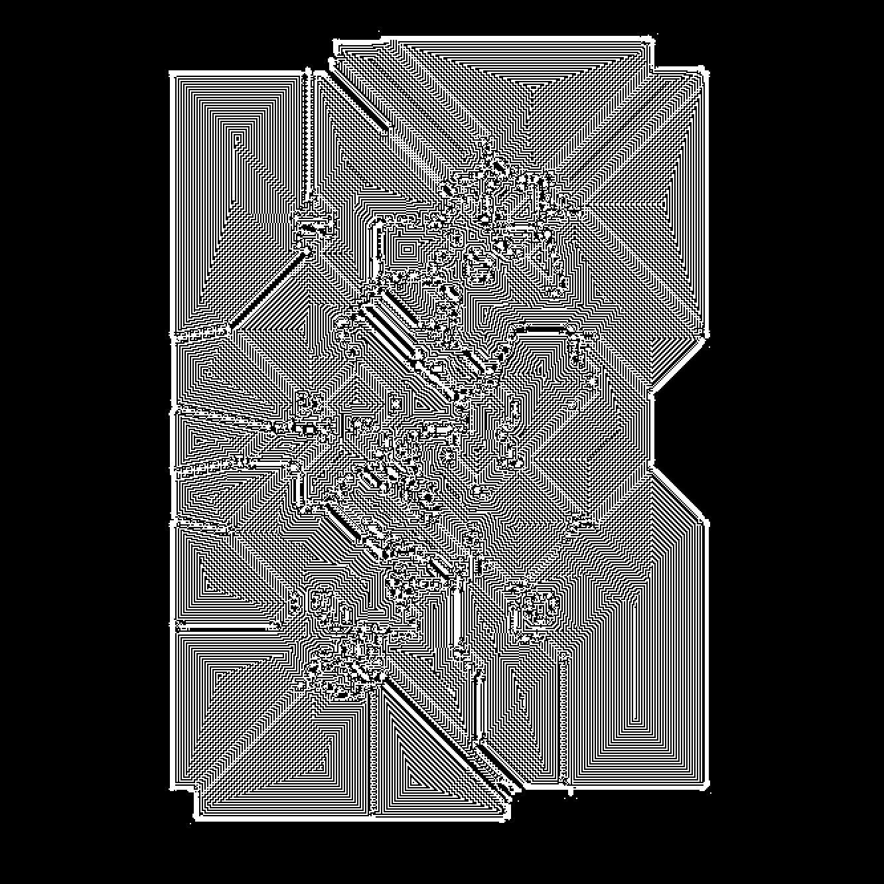
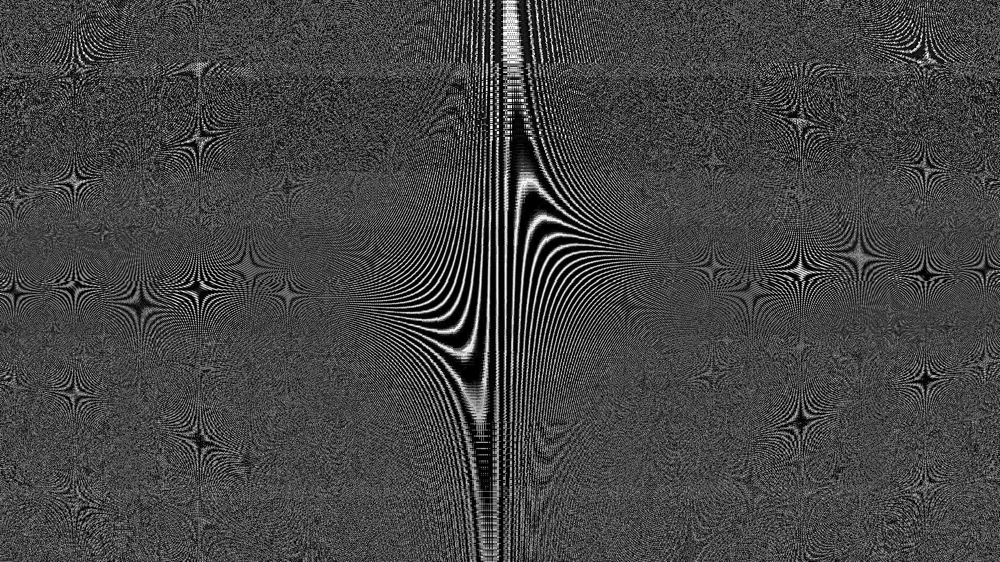
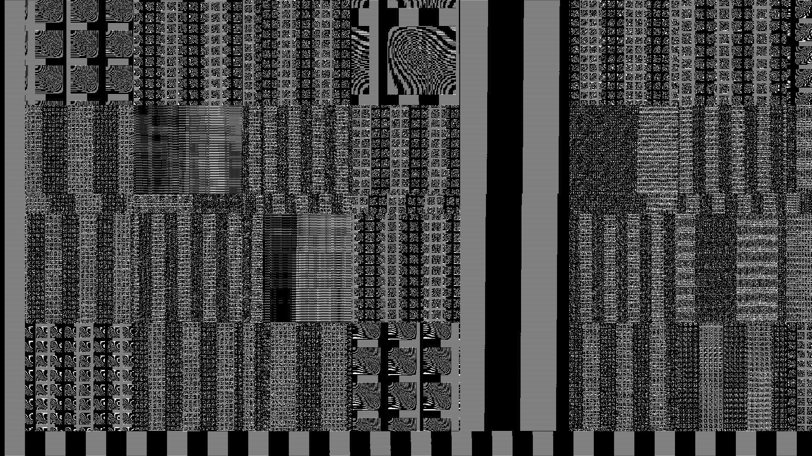

The Weatherman / NOA

**Weatherman:** Lost AI weather program. Max Headroom vibes. Trickster. Amoral. Spastic. Wild. Kind of a comic relief…

Plays on all the TVs in the wilderness, voice booming through the landscape.

Controls the weather, throws things into discord whenever he wants to. Turns the tide of certain major battles in the game with major hurricanes, typhoons, etc.

Raining fire, super lightning storms.

First meets the players in [the great wasteland](/p/2e52e2f53aea40569e46d4db26a5cb37). That is where he has been exiled by the lion or someone before him. Well there's no technology here. Yes, but there is the player's HUD. Or rather his PDA. So he sneaks in on that frequency as a stowaway and is released once you get to [the City](/p/a699c2b67ea049b1b3fabfa0c667582d).

Maybe he's actually useful as a weatherman here. Like he tells you when dust storms are approaching.

First subtly, then with more alarm. It's impossible to hide, because he tells everyone where you are.

Later follows you and appears on telecom screens all over the city. Pitchy bleat of a error code/lost signal degenerates into screaming laughter.

He is kind of this effusion from within civilization which is both its purest essence and this purely destruction irrational malice—its essence and its opposite. This excess, like Iago or the Joker. There’s no conceivable reason for his following you. Just as there was no real reason to create this civilization in the first place... no real necessity. Yet the whole world has been transformed completely beyond all recognition.

Weatherman sends all nearby electronics into emergency alert mode. Eerie wail…[Double-Header Tornado and 2 Same Special Marine Warnings for Areas in Maryland {EAS #1322-24}](https://youtu.be/ohoLhUEzFfY)

Corrupted signal example (should be .gif)

***

Before the Air protocol is disabled, he's restricted to changing messages on all the interfaces and [Holoscreens](/p/5d464dbb20064ec69984561f0bbee062) of the city in an obscure way. Sometimes blocking doors, or messing with you, but [Firefly](/p/fa265d0089834a398c8b7a51bd6d8cb3) can lock him out.

[After the deactivation of the Air protocol](/p/d1d6ea4ea51f4f549e3cb4439cc977be), he releases his full power, controlling the weather. Inundates the city with snow, hurricanes, various extreme weather events.

Whereas formerly (and this is important) there was nothing there but a steel grey sky. The temperature was extremely even, unchanging.

Tornados, typhoons...

***

<https://vm.tiktok.com/ZMRm3gwdA/>

The eerieness of the emergency alarms  beeping in the dark silence as the wind grows.

Tornado sirens, storm warnings...

## References

[After the deactivation of the Air protocol](/p/d1d6ea4ea51f4f549e3cb4439cc977be)
[The Lonely](/p/2e52e2f53aea40569e46d4db26a5cb37)
[Story Roadmap (with scenes)](/p/64c71b1bfb2a4717a53593ce05b258f8)
[More pics](/p/2adeb94de0124da1aa544df8196096e4)
[Liberty](/p/f92b3507b1bf46cc81c6c04fb40efa41)
[Another Synopsis (top-down) \[best\]](/p/735c96da2df5451eb19b2b2a6b342e74)
[Beginning, introduction](/p/41c70b5d8c814f7b8fe9d4e152fdf43b)
[Word List / Categories](/p/193c4b3e6ea24170829178087aec70c1)
