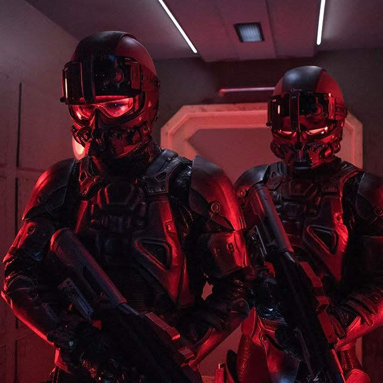

# Warfighter (Base Team)

By far the most common enemy in the game. Comes in all varieties, from the common soldier to jet-pack laser-soldiers.

All Warfighters are 80%+ cybernetic, and are thousands of years old. They are under the complete control of the [Lion](/p/2001b9b679ed4d8abbd8cfb46998773c)—who also controls [Messengers](/p/ad88bd18603b455db621ae9f9243c7e4), as he holds [the keys to the barracks, as well as the key to heaven’s door and the key to the end](/p/b416261f502a4586ad3f4dc1353346e7).

No. He’s **seeking** the key to the end. Which is [The End](/p/96f5dcec0cba496fafc1e25040a57b07)...

More like the guys above than the guys on the left. Just less cartoonish

So they are basically cybernetic soldiers who are more machine than man. Nothing is left but the bones. Thousands of years of upgrades and updates mean that most of them have died long ago. They have a shadowy existence, like [ghosts](/p/da622103663d4fad8372a8769414cc25).
