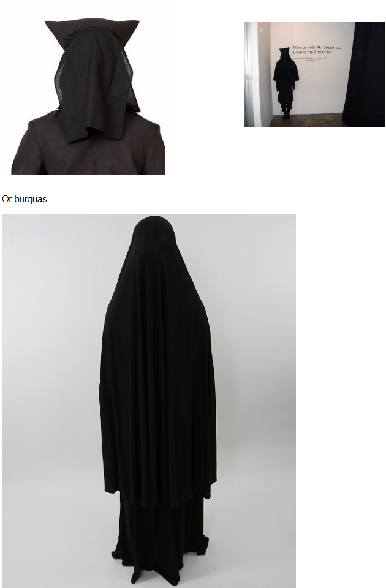

Witnesses

Enemy type: Unknown

Idea: **Witnesses**

Creatures in total dark cloaks, like burqas.

Visible, expressive eyes. Travel in groups.

Gold Heart patch sown onto where their heart should be. Man I wanna see a visual of 8-10 of these creatures following. Or maybe a badge.

If you are evil enough, you will not be bothered by the @@devils (they’ll leave you alone), but by the witnesses.

They are invincible.

Gameplay use: Because they’re so strong, you can use them as cover.

They are so plaintive that if you look at them, they will stop and look back at you.

Like those japanese stagehands

The witnesses' whispers have different names for people. Perhaps their true names.

They call [Sunset](/p/e86dde5ef894493cb5e1f93855b62c83) “Adam.”

They call [Lucy/Sophia](/p/dc866b99f5794c99874dbaae8479870f) “mother.”

Each one has a heart of gold.

Also constantly ticking. A gentle ticking, like a clock, or a bomb. Or a heartbeat. Something sure. And they all tick in time.

You only hear it when you get close.
