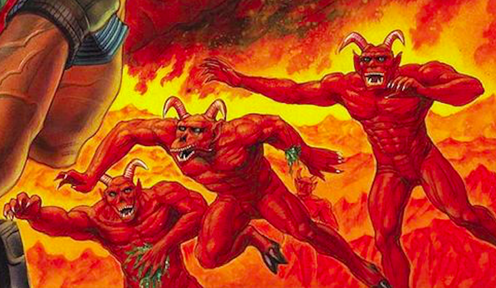
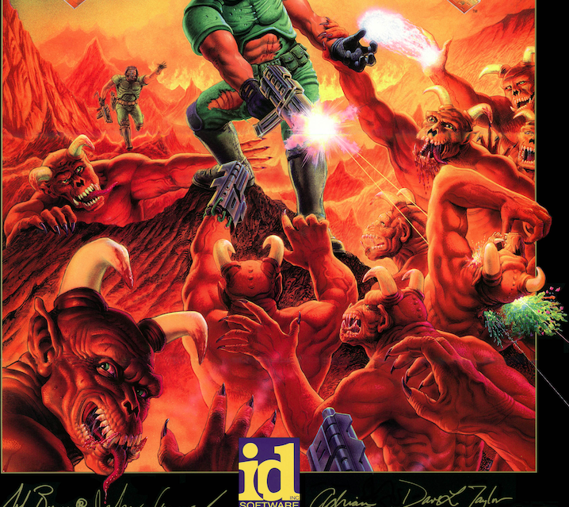

Enemy: Devils

Enemy Type: Natural feature

Evil, bat-like creatures invading over the rim of the edge of the world, sweeping over and destroying everything.

The embodiment of primordial chaos.

Horns over leathery red skin and glowing red eyes. Claws on hands, some have dark wings.

Basically look like Don Punchatz’ Doom Demons:

Once the Lion leaves the throne, the spell that held them back is broken and they begin to overrun the universe.

Later in the game, you encounter “the devils beyond the darkness.” Much more powerful than the regular devils… much darker, larger, tougher, w/ huge wings—and can conjure + throw mega fireballs.

(unless you have certain items) The devils’ [fear bar](/p/445e797334f84ea289ef2dd329a4c488) charges much slower than the warfighters’

Maybe [Heart (status system)](/p/6f324ef2228f4369a20a5e88999881b5) effects this.

They are generated from the energy gradient caused by the darkness of the universe.

The [Air Protocol](/p/39af5dfd7ca34fd2ad511129944e10c9) keeps them in check. Once it is disabled by the Lion, they are loosed on the world. It operated on the gradient between dark and light energy. Now the dark is unlimited.
