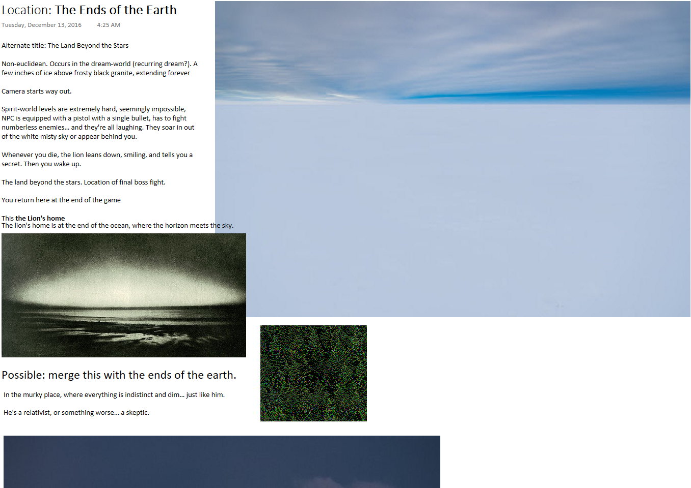
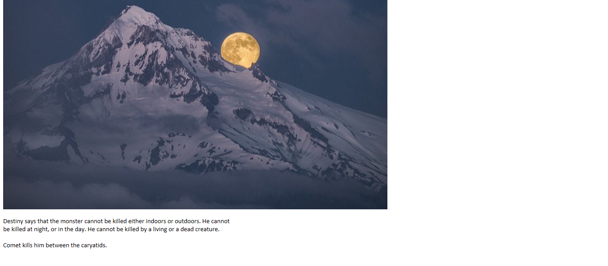
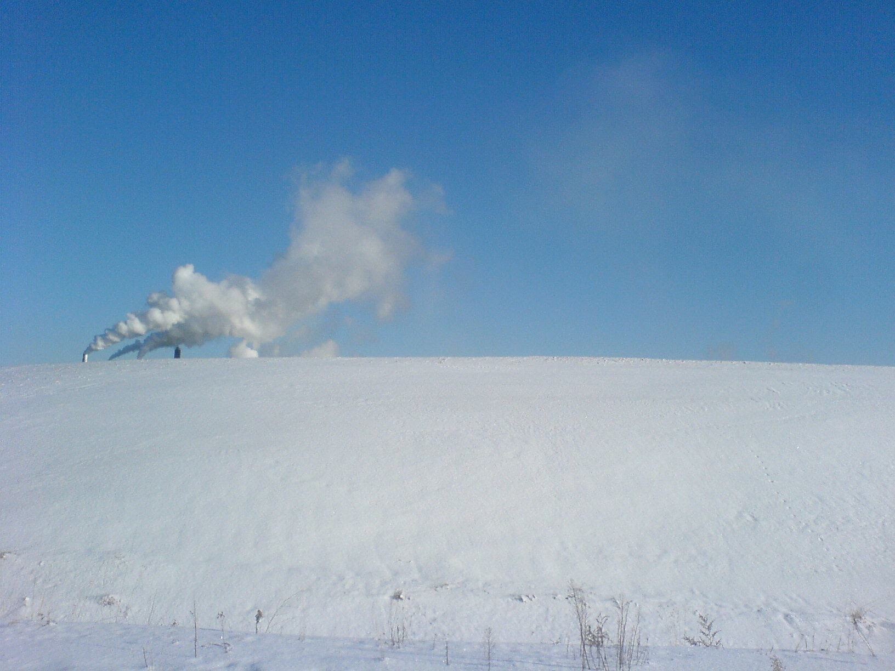
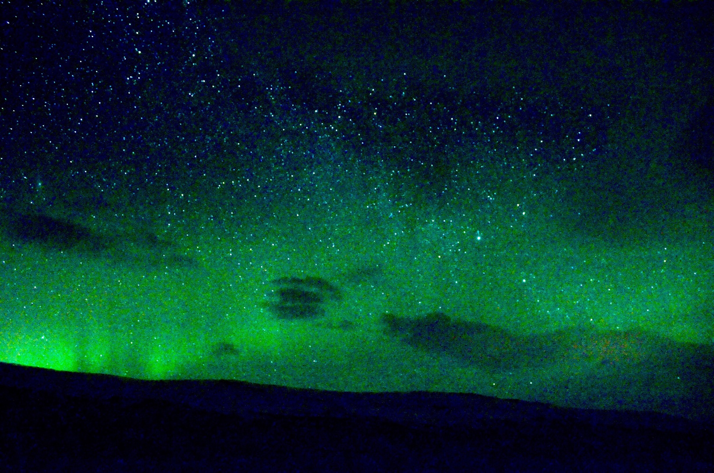

# The End/Nowhere

A farlands type zone where everything becomes unclear. Pocket dimension where all objective coordinates are undefined.

This is where the lion flees, where you have your final battle.

[The Surveyor](/p/c7964e9075b3441eb4bd789fd283aa6a) is hiding here. Embedded in memory. The destination of the final [Activation](/p/6186266638ff44bc9fa48d3cb912f53b).

Hidden beyond the edge of the universe…

Alternate title: The Land Beyond the Stars

Non-euclidean.

Occasionally intrudes in the [dream-world](/p/c6ada77226e24eab9558973d33216c8c) (recurring dream?). A few inches of ice above frosty black granite, extending forever. [Footsteps form on this terrain.](/p/8e4453da33024fff9ae92105ae14e534)

Camera starts way out.

Spirit-world levels are extremely hard, seemingly impossible, PC is equipped with a pistol with a single bullet, has to fight numberless enemies… and they’re all laughing.

They soar in out of the white misty sky or appear behind you.

Whenever you die, the [Lion](/p/2001b9b679ed4d8abbd8cfb46998773c) leans down, smiling, and tells you a [secret](/p/8745a29a9b92485c8e2a965fd6875a37). Then you wake up.

The land beyond the stars. Location of final boss fight. You return here at the end of the game This the Lion’s true home The lion’s home is at the end of the ocean, where the horizon meets the sky.

Possible: merge this with the ends of the earth. In the murky place, where everything is indistinct and dim…

[The Prophecy](/p/03ed3db7a132404dbc0c094de353e46c) says that the monster cannot be killed either indoors or outdoors. He cannot be killed at night, or in the day. He cannot be killed by a living or a dead creature. Sunset kills him between the caryatids.

***

Suit keeps out the environment.

Hacking from enemy agencies ([Devils](/p/a22030bec1ff40e587d2146fb95be185)) at [the ends of the earth](/p/2ba18aefabb84a348add14a36c1d3714))… messages flash on the suit GUI as you can hear your breathing get shallow:

ERROR = ATMOSPHERIC O2 LEVELS REACHING CRITICAL
RETURN TO OXYGENATED BIOME IMMEDIATELY
LOW ALBEDO – CELLULAR RESPIRATION IMPAIRED
CANNOT DETECT GRAVITY SYSTEM
(interpolated with malicious messages, as well as screen glitching/beeping)
A voice (the Lion):

What are you searching for?
…

Do you think you’ll find it here?

***

You first visit this place in your [dreams](/p/c6ada77226e24eab9558973d33216c8c).

Final cold zone. Only landmark are the two tearful caryatids, worn almost beyond recognition. [Justice](/p/fe6019bf0f1f40eb990fb3fc1da2494f) and an empty pediment, where [Liberty](/p/f92b3507b1bf46cc81c6c04fb40efa41) once stood. Reverse of the empty pediments in [the City](/p/10e73639c05f4ed1bc3262e2e8d8296c)

An arch…

Maybe [Maxwell](/p/fa265d0089834a398c8b7a51bd6d8cb3) is here. Busily guarding the universe from the infinite coldness of the external void.

## References

[The Lion’s Study](/p/2ba18aefabb84a348add14a36c1d3714)
[Abyss/The Deep](/p/ac458f6ea8e2410e9eddcdc79d5a90f7)
[Serpents of the Deep](/p/f118167e8a4f4bf58bfd839673c964c8)
[Obnoxious Questions (used to flesh out the game) Annoying Questions FAQ](/p/0b6fa809714a4d62bc688da4979df27b)
[Directions and Plot Stuff](/p/a8eca5450f514d4a905d7382db289616)
[Game Ending](/p/39d9f7006aa64ff9990efbcbcdb84d89)
[TODO List (SOS)](/p/4742b7c786aa444fb1e01144c78d2890)
[Story Roadmap (with scenes)](/p/64c71b1bfb2a4717a53593ce05b258f8)
[The Surveyor](/p/c7964e9075b3441eb4bd789fd283aa6a)
[Guardian Devils](/p/4f79eabdd870462cbc159e5477f56726)
[Sleep/dreams (status system)](/p/c6ada77226e24eab9558973d33216c8c)
[Location Pair:](/p/d9f3e04fbd51419eb6ec1a41624e4ffd)
[Elevator Pitch 3 (bottom-up)](/p/c60cc3e805e545fd886efd133271279c)
[Old Summary](/p/355f63b2b1c84813a1b2eb2bbb2cf2bc)
