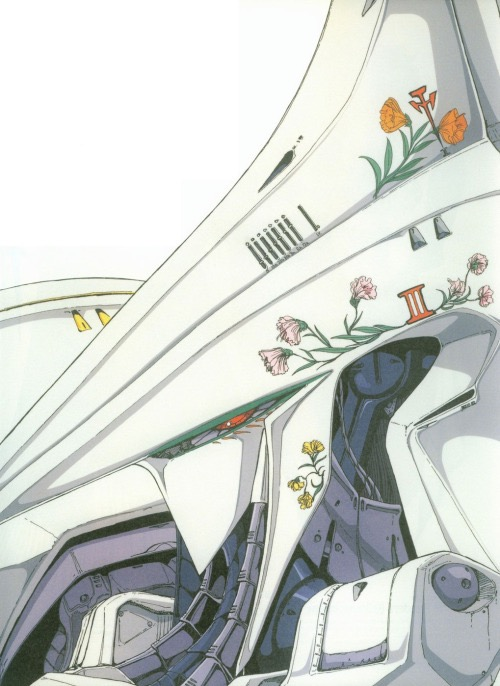
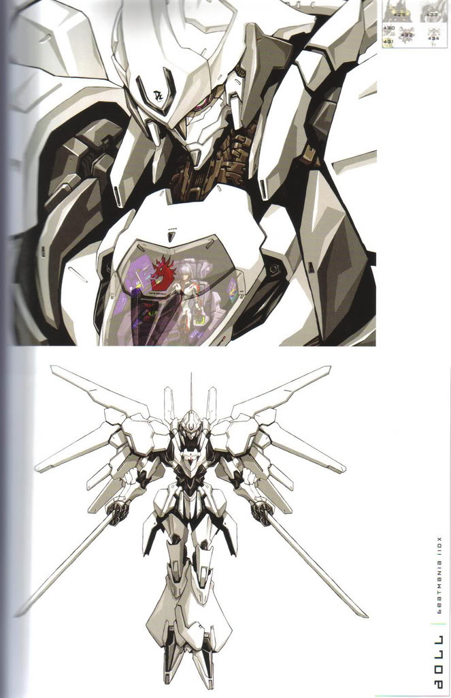

Messengers

Enemy Type: Boss Guardian (plural)

Messengers are pure white mechs with big, angular wings which leave bright blue streaks like the tail lights in Akira. Crosses of gleaming light when they charge their rayguns… about 2-3 seconds between shots, each shot does huge damage but they can be dodged. Messengers can fly and like to flank the player with long, broad sweeps. They also having flaming swords.

Unlike the [Warfighters](/p/64a95ac03b7546249ebe255b2b2fd8a6), which are controlled by the [keys to the barracks](/p/b416261f502a4586ad3f4dc1353346e7), the Angels are only controlled by the one who holds the [keys to heaven’s door](/p/b416261f502a4586ad3f4dc1353346e7).

Depending on the order which you acquire the keys, you could be leading the Angels against the Warfighters, or the Warfighters against the Angels.

Or, if you choose [legendary difficulty](onenote:Gameplay%20Ideas.one#Difficulty%20System\&section-id=%7B67744DB0-0E1B-594C-9CED-2D9C164B8A1F%7D\&page-id=%7B6C445D11-7B3E-7A42-A7C3-6E92FD17804A%7D\&end\&base-path=https://d.docs.live.net/8abfb947225be949/Documents/Will%27s%20Notebook/Song%20of%20Sophia) (which you can play after you beat the game, makes everything more hardcore), then you have to fight them both at once.

 

Deep Lore:

They are souls bound to the machines in an attempt to become immortal.
