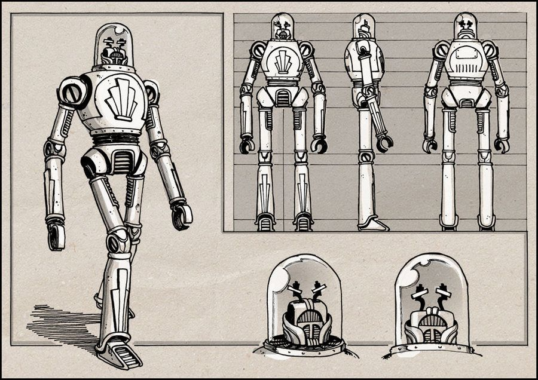
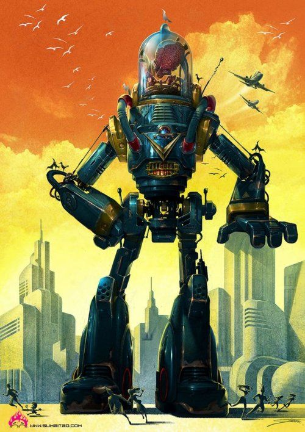
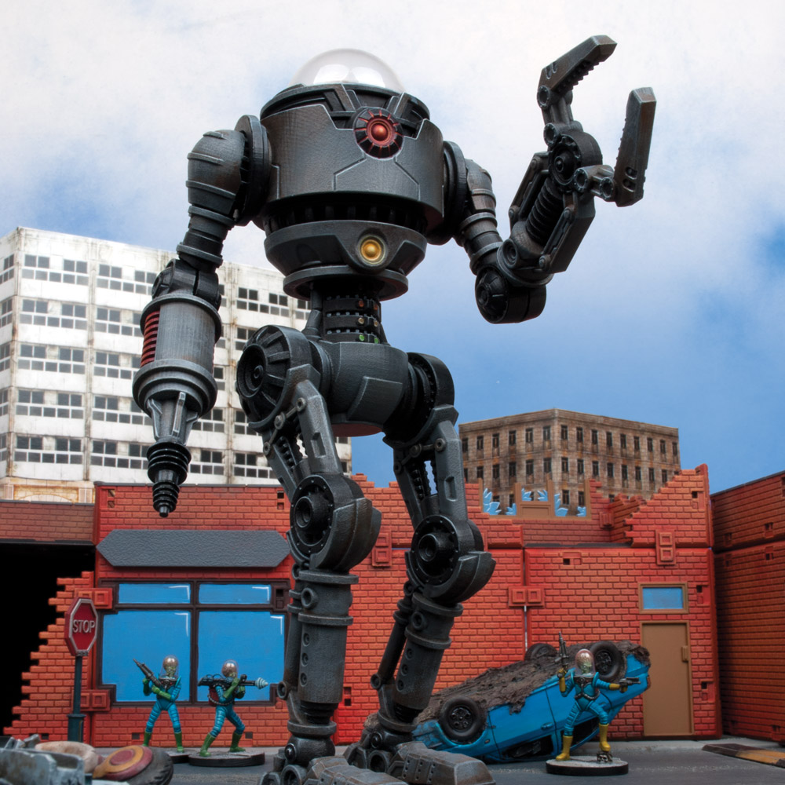

**Glass monster** like from “the road.”

With a head like a giant glass dome with organs jiggling inside.

Like one of those glass transistors.

And metal arms and claws. Slavering jaws and big blind white eyes

I can see it so distinctly. They’re medium large. Not as big as messengers but they tower over the PC

What is that thing? Repairs [the Air Protocol](/p/39af5dfd7ca34fd2ad511129944e10c9). Kind of like a big daddy from Bioshock. So they’re on the loose after the air protocol is shut down.

In the early game they ignore you unless you tamper with the air protocol, even by a stray shot. But you can trap enemies into it by standing in front of critical AP grids.

They’re called “Glass Dogs”

Later in the game they’re driven mad by the AP being shut down.

Maybe it’s a glass transistor like thing but with a weird energy fire inside. Its soul, life force. The AP failing only makes them more powerful and energetic.

They are enraged, trying to repair everything.

Ok. Let go.

They’re like an anglerfish mixed with a 50s transistor and a giant hulking ogre mech. Mixed with Robot Jones, Robby the Robot, and the iron giant. Almost Zeerust.

A bit like the supersoldiers in Wolfenstein

Eating [Devils](/p/a22030bec1ff40e587d2146fb95be185)… disgusting spectacle of nature.

Kind of like this, but more animalistic.

But again, more animalistic… big white empty eyes…

Glass transistor head. Mechanical body…

Giant steel jaws…

## References

[After the deactivation of the Air protocol](/p/d1d6ea4ea51f4f549e3cb4439cc977be)
[Crackle](/p/a83ed73098c5416684c4c5d4097e32dc)
[Story Roadmap (with scenes)](/p/64c71b1bfb2a4717a53593ce05b258f8)
[The Air Protocol](/p/39af5dfd7ca34fd2ad511129944e10c9)
[Word List / Categories](/p/193c4b3e6ea24170829178087aec70c1)
