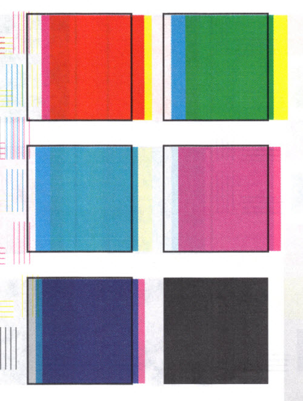

# **Refraction**

Things come apart. Matter and form separate. That’s the way of history. Echos/shades

In time, everything falls apart.

If a color could exist without inhering in something…

The echoes have lost their memories and their tangible form.

The [Lion](/p/2001b9b679ed4d8abbd8cfb46998773c) has everything but conscience, but love.

The [Witnesses](/p/71f7bbe694b74dde9a39c628cfc1e9ff) have everything but a voice. And this is not their fault. But our own blind deafness.

***
