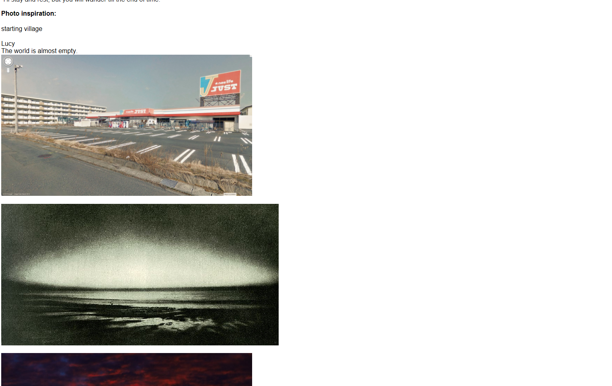

Song of Sophia (old)
song of Sophia credits: say goodbye Hitoshi Sato
with chibi rule 63 characters with antagonisms reversed
Scuffed Sunset (Dawn), Leona (Cat). Luke, (Male Sophia) & Ada (Cain)
Comet/Luna

![Before it was our life, it was a song. It was on his first day in prison that he met the former princess Luciferna and engaged in idle conversation with her in the stoneyard of cell block D. land is called Tartaros. skeletons, demons, imps. vague 90s visions of hell. horned skull peoples,spooky ghosts, eye important to be a comic spectacle Music is forbidden in Tartarus. it attracts sinners, fallen angels, etc. their appearance indicates a higher world that they have degraded or given away. very powerful bosses. you win music by beating the fans of a track. landscape in ruins. nothing too high tech, just vague. not easy to tell what it was like back then. it's been many years. the material advancement is a counterpoint to a spiritual desolation register of the dead to find the girl—lost in the numberless cycles of time, amid the mountains of steaming detritus, buried among the uncountable outcasts of our civilization huge expansive landscape, mute protagonist there was an insurrection, now only hell is left. obscure and difficult to understand theology provide the world's underpinnings little spaceships travel fast. they're all beaten up. (now HYPERLINK](../resources/9a0a063e6cd14ce03f70545ec867b9a8.png)

![ElEv-1kd-t3KNJStGSCag4io4cM\_RSolfRR22uExbxaWa7o7VVuljEads3BGfc0Fw6JKIUim4rE5rKU\_XbVCja-Z7aSxgXtYc6iSclJf6EykuIfzvC7qtTqa1KSECyM8iShx6RTM Weapons: AB101: Standard issue laser rifle. Semi-automatic, good for mid-range targets. Can be loaded with different types of ammunition. Botany: Gopherwood trees. These populate the forest around the Tartaro estate. Prologue: The Shores of Hell Sunset is making the ocean red. He meets Sophia: She has a sad expression on her face. The player awakens in the prisoner processing station, in a line of prisoners. NPC enemy types: Princes of the Empire (bosses): About 12-30 of these guys. They look like revenants but dressed in dark robes and regal dress. They wield miniguns, and move extremely fast. Imperial Chapter 1: Tartaros The main drive in the beginning comes in a dream. It's here, forced to hunt game (deer) & conduct pest control (snakes) for an imperial potentate with a gang of other slaves, that the player develops combat skills. Hot weather breeding snakes. Prisoners pressed into higher hunting duty. “If only they were as peaceful and as lovely as their maker.](../resources/6774b7a2c225ebd167c93b7300bd9c09.png)

![29d1PDNT6SudzggzIdlsz1\_8Nmj\_k44uEdIabA7uzKO38YEPpaEgntjBNUZePh0\_U6G8PNK70kJ5TPKQZWem5qbtmeKH-D1fKsI1O4aMvj\_mbGFXCY4GPCQYx-KCs8xHUDBrio67 bBlZiBsnXUYQ2zZ8ITSSBpUHDPrFPStYWCeLXkt3T7SdnOsmXf4GB0xDK\_bHnuE00tJRRm9uLAh0wwa4VVsWFo1Vzrqppnx9sX91BuJFDHzpkc8G8QV0AfNrhckQye7NassmBokL THE WORLD IS WATCHING Need a better motto! ^motto ^Imperial Guard Insignia (shoulder badge, wall-posters, etc) “Evidence of a real pre-existence: I have seen you before, amidst the marvels of primeval times and at the end of time.” KUrQDD4t2C6QpEx2hswc6kuJ\_PDG7EHdM-VNUlxFGmNv5njkUqBHOyQaYS9OClYhbkMs4XKN3GGnHAiDQ8LkV85LM34jKM9j4mgmIYzyZlPdlz5lOz2oU28PI8MmFpUL2bQdgM0O](../resources/4e965631a61ab4d984d780d145782b4b.png)

![1c3RK3iweW99ZeW-AvJJ7SeMobYWhH3IS2ROQM4n0k84OPaDIbKh6WqHV4vuW7KEOeP7BOn-WGyw0\_ht8Xo-Cnf8hKJWO5Hfz\_Z5RRsiqeS\_C9t7Ln9lirkGkebwciScFEm6ohGl oX-wu8JBbmvEIgPS3no0d2JqziTzUO2QeQbeMD7O35rghLk0ALA9d08b79xPidzI5\_66P6TOCoQW6kasOedxn2pGsci5IBiBvXq3-4mQk5gZoHKjq0DEccKIXVS3BqItL9-FFFOM q1Z23VOk0gVjt3PEf1WLvrdxN-79\_enMseyYWlsrjV1L2vubZU2Kc7PzPBNMB51XcOxqSH-0-c\_ONqPULEPhIr2yDkSPxfDhqAxCO9CRIISad-AyEWe5NifkYG-DWuvwNhIws1LJ G6GoOyu\_lHNC3mGc7GBfZ0v7YLW-KaamFrtThpKFRrxerxerU\_jhNm2Htq9hjcs-YRwaBNAZnKNLf5xHpGW-YT-kQ3IDJvVIvme3B4rSlmo4LEArh3OrVFqfdaoIG6wFJ5Fl54Rb](../resources/a3f8f3b6cb0fa01ffedd2452696a4298.png)

![OCJx2XElppDiQiKJPRz3O7E5-t84G1abdowgz-JTt6j44IiPZhWT4DHEogPnArpY9lmIAEjFs8Obb3VlTjchnNz22xjAUqg5VD9LQB0xdI25Z-ub-bPOiTMZDb2dbRHQ49sMjhz9 Story Chapter name: THE PARADISE OF DESOLATION 820GSSG271-4IYx1LsUKLT4IOn\_mOR1cfRdysowYZzs9gFA89mSJ2Bqoq8vmJZ1bNvaTwNbxdjGMMnlneC7Jfde05WhH8TmxF6ErG4eFsZAXUCWfzRPXKCdQKfNlmVON7tXuPfD\_ dS5A-P076eYTdb0kWQyfWRqNDaoEtbzFuoJDF-AU9uWIfGKnuYAPaQ6H8o-yNUyhjs-8LGfYzJu1\_EmbjoFTEf2rW7N0NEhVv29sGKAptGMb8DMOpgs8GvkQPFeBFXvuTaASZRBX Fight Chapter Name: THE HEAVEN OF THE TIGERS bwweQ\_1\_mwyGNpqwC7ASnCuYO\_BzJIiB6MuekeG39RgNrJUrNv6bMPSPE4Tjt0pBC8F0RBgMG06lPIbP\_yS732WV7xDPkrmn-tD9TK\_B10E0iZyctTd2oWxPl\_lS3H5PFG9CiNh\_](../resources/dc1d5d55d841157d0e1083664b7c94f3.png)

![bwweQ\_1\_mwyGNpqwC7ASnCuYO\_BzJIiB6MuekeG39RgNrJUrNv6bMPSPE4Tjt0pBC8F0RBgMG06lPIbP\_yS732WV7xDPkrmn-tD9TK\_B10E0iZyctTd2oWxPl\_lS3H5PFG9CiNh\_ ZGBkVf0rq02boVqMvgKkq4z6rALiy8WsSHFih6OZ5tGkw6tv1sN9OmgF-E9E6obEfTFBWxkPukM-nMcAP01T33vtkyWgrl9brLuwFqBCSseq4LCrUgQVy60KMGDZejPACCEL\_dDJ VY3mGXYaspYjc3yC4rAJqxWE3hxDD4UgLKsxRpZ42HxIvbtDYMLQSCaWxHtnSjQJB-6jpX9hqd5p9nUSlg8JtDwzqLBrINUvziWcDkghj3FtwofJcOsu-saP00smvt1Vn3CilVLH FJT\_YxIl\_9lhUY0cdwPByPmXGrcfWhohxFymRfZwfGrNgShA6uo2RyNsLNOSh3\_x1h7N0G397JaDPGiwHQN9pnzQ3FbaB5crV3TzAKipZ9y4WZxjJF9QDU23S632\_TbdDJmGpR6x](../resources/9897cf37fe64abcce390490f03f3a12d.png)

