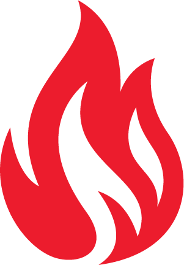

Firemen

Type: Evil Spirit

Employees of the [Fire Chief](/p/1ef4b06dc1a54d4b8711df3ec9c45c5d).
Even more on fire than the fire chief, with melted helmets & crackling ash, as well as huge plumes of smoke. Have fire axes and firehoses (which spray fire instead of water).

[Noon time fire siren in Hawleyville](https://youtu.be/PXtqK-mwyW0)

*in the fight with some of the last echoes, [Lion](/p/2001b9b679ed4d8abbd8cfb46998773c) changed the CVAR that controls stopping fires from 1 to -1, making them want to start them.*

MOTTO:

TIL THE END
