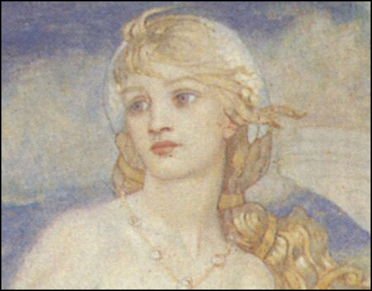
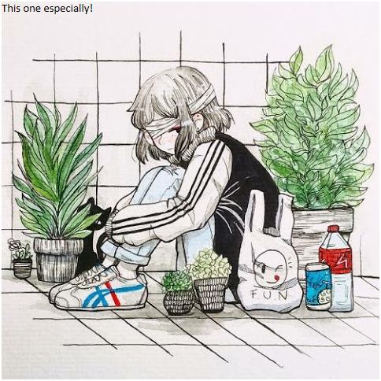

# Lucy/Sophia

Maybe a better name is Daisy. That was the name of Doomguy's pet rabbit.

She’s a princess… so she can't be Daisy.

But there is a mute poignance to it.

*Shard of an energy generator which can be used to power a universal constructor.*

Answer: Lucy is the **battery**, the theodolite is the channeling instrument (the constructor). But it was destroyed... [The End](/p/96f5dcec0cba496fafc1e25040a57b07) shows this. Sunset is the monster who will devour the world. Because he acted out of love, not selfishness, he is chosen to be the source of a world-renewing love. This was always his purpose. Ok, I'm going to repeat that elsewhere.

An echo of ancient Sophia.

She gradually remembers primordial songs…

^ last image best

Sunset chooses to stay by her cause she was the only one who was nice to him.

This is reflected in the words of others. Bites through her, cracking bones, blood, death. Fang pierces her heart. Lion: “Why did you stay by her? Was it because she was the only one who was ever kind to you?”

“I don’t know why she chose you. I don’t care. The reason why I killed her was to make you suffer. That’s why I exist. Not to kill you, but to make you suffer. That’s the only reason you’re still here.”

Lion looks up. Shadow of melancholy. “I have nothing against you. But it’s my purpose. It’s why I exist.” Gentle laughter. “What else can I do? A leopard can’t change his spots, you know.”

# Lucy *(short for Luciferna)*

Slave girl who trains the PC. White hair, **blind in one eye** (white). Other eye blue.

Shorter hair while a slave, hair grows long in freedom (remarks on this)…

**Sign:** Delta

Ghost of Sophia

Sunny & lighthearted.+

Takes a while to reveal herself to Sunset.

Embarrassed by the memory of what she was. Mocked by other cellmates, has to explain herself to Sunset.

Dialogue:

“I just want to go [home](/p/a20eec20a73b4baf90f96bd591b6d7ee)."

## **Sophia**:

Higher aspect/[Activation](/p/6186266638ff44bc9fa48d3cb912f53b) of Lucy. One of the [primal people](/p/2f7c73ff336643cfab6933e00eb6b40e) primal people. Only appears in dreams, visions, or liminal moments. Bookends the series.

Dialogue:

“I’ve always been here, Sunset. I’ve always been beside you."

“I speak through all things. Listen, and you will hear me.”

Once Sunset’s memories of Sophia are conquered, she can be created (first people schematics imprinted in ghost-Adam’s memory)

Sky-colored skin.

***

Singing a new world into existence,
This is the reason why Lion stole Lucy.

Within the shadows there are pockets of energy. Some of these are so great that they have the power to reverse time. But this energy in Lucy needs to be directed. This is achieved through [the theodolite](/p/dacfbbf983bc428483bfc033e194a678)

[Witness](/p/71f7bbe694b74dde9a39c628cfc1e9ff) names: Mother. Sophia.

One red eye, one white one.

### A word from [The Surveyor](/p/c7964e9075b3441eb4bd789fd283aa6a).

*It is reductive to say that she is just a battery. Or in any case, it is too easily given to misunderstanding. That is just how the Lion saw her. She is energy, because beauty is energy. Or she is something more than beauty or energy which words can't describe. Of course something like that could turn back time. But she's more than a tool. That is the difference between you  and Lion.*

## References

[Witnesses](/p/71f7bbe694b74dde9a39c628cfc1e9ff)
[Story Roadmap](/p/64c71b1bfb2a4717a53593ce05b258f8)
[TODO List (SOS)](/p/4742b7c786aa444fb1e01144c78d2890)
[Primevals](/p/2f7c73ff336643cfab6933e00eb6b40e)
[Music Mechanics](/p/4f10d741d1b949dda6606a9af27b0225)
[Firefly](/p/fa265d0089834a398c8b7a51bd6d8cb3)
[Brief Summary](/p/fee65c6bead3412cab91a0ef60fa45d4)
