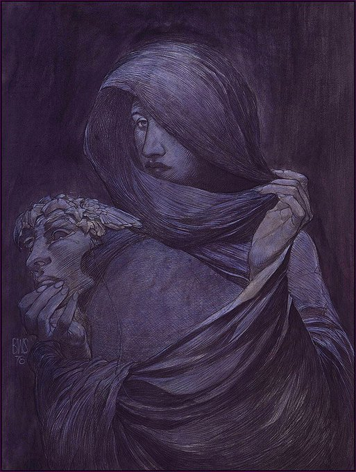
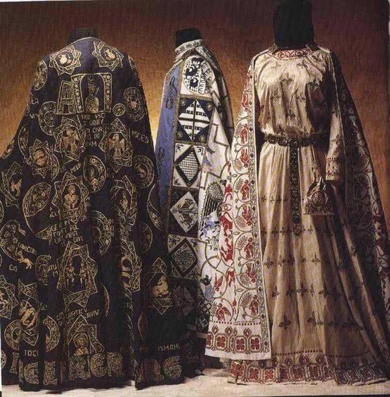

Enemy type: Lost Soul

Humanoid creatures wearing long blue capes emblazoned with shining golden stars. They can shoot magic homing lightning bolts and spawn [wizard-devils](/p/f46513ec051945a2b5cc36154bef3656) (a type of devil *supposedly* under the wizards’ control… it looks like a regular [devil](/p/a22030bec1ff40e587d2146fb95be185) but is blue and star-spangled)

Monochromatic shadowy and sallow figures.

At some point in the story you are invited to one of their dinner parties. This is all disrupted. Maybe the lion invites you to one, as a prisoner.

Also a great chance to include the [warfighter butlers](/p/446f0d27a559475d9d0e1337fb7cc934).

Dress and demeanor of late byzantine aristocracy. 

