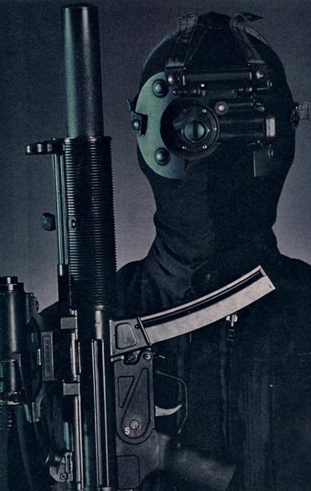

Liquid team are the first level of stealth soldiers. Their camo helps them blend in, and they use silenced rifles.

Similar to HL1 Assassins.

Vapor team are invisible.

Their decloak is subtle, a sound like a whisper. Should be piped directly to the player, no chance of not hearing it or complaining about RNG. Really distinctive sound to set up a Pavlovian freakout.

They only attack in certain zones… their camo packs generate a weird force field (GUI disruptor), so you know they’re nearby, you just don’t know when they’ll attack.

