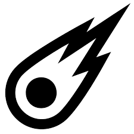
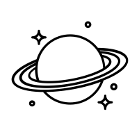

# Sunset/Nightfall \[player character]

**Sunset**: Main character. Mute, nameless, red-haired. Referred to as “John” by the Knights of Eden.

Actually the ghost of Adam, one of the primal people.

Called Sunset by everyone: why?

**Nightfall:** [Activation](/p/6186266638ff44bc9fa48d3cb912f53b) of Sunset. Above a certain level of understanding, the PC incarnates in this state.

Harbinger of the end of time. Frightening. [Lower-level enemies lay down their guns and cower.](/p/445e797334f84ea289ef2dd329a4c488)

Perhaps Nightfall has the power to speak a single word.

Nightfall has dusk-colored skin. 

[Witness](/p/71f7bbe694b74dde9a39c628cfc1e9ff) names (which they whisper): **Clearinghouse[^1]**, **Animal**, **Housekeeper**, **Nightfall**

[^1]: A clearinghouse is a kind of nexus where accounts are settled.

He is not the monster who devours the world... but he is a shadow of him. He was created to guard [Lucy](/p/dc866b99f5794c99874dbaae8479870f). So who is Lucy, then, if not a battery for a universal constructor?

### Sunset's True Purpose

Sunset is the future-shadow of [the monster who will devour the world](/p/03ed3db7a132404dbc0c094de353e46c). Because he acted out of love, not selfishness, he is chosen to be the source of a world-renewing love. The world is made in a certain way. He's not special except that he is the center of awareness.

## References

[Signs](/p/51a96d9178ab4a72ba6384a7f3faa7e6)
[The Prophecy of the Monster Who Devours the World \[thinking of deleting this\]](/p/03ed3db7a132404dbc0c094de353e46c)
[Witnesses](/p/71f7bbe694b74dde9a39c628cfc1e9ff)
[The Air Protocol](/p/39af5dfd7ca34fd2ad511129944e10c9)
[Wandering Stars](/p/f4a90264fddc4ff6af8749329d31eb50)
[Beginning, introduction](/p/41c70b5d8c814f7b8fe9d4e152fdf43b)
