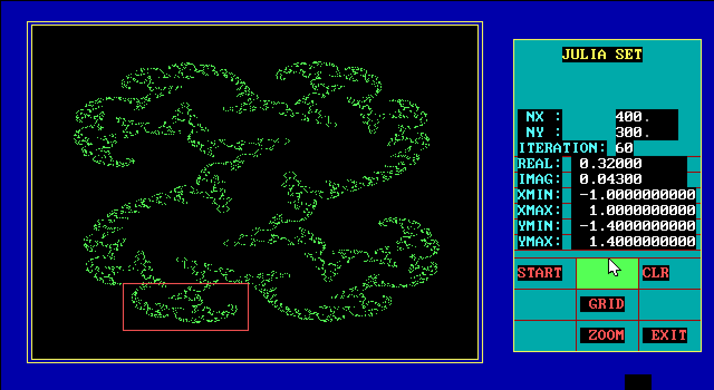

Planets are connected by stable lines. They go for millions of miles through the darkness… some way of traveling from starports to big locations.

What if all transportation was handled by trains? Even **interplanetary** travel done via a Starbus which travels a fixed route, between stations. Certain lines are out of order, temporarily or permanently. Secret stations, stations off the beaten path, etc… fun. Terrestrial and superterrestrial transport. All rushing through the darkness.

STARBUS - CONNECTING COMMUTERS

***

Gotta keep this idea of a world which functions without human beings. Those flipping cards... you know, like in a train station.

Starbus system still frantically changing, trying to maximize efficiency, even after thousands of years. Routes and schedules constantly rearranging, mostly around sunset. It's extremely confusing, so the interface just involves going through the index of locations. But behind them you can see the infinitely intricate map reconfiguring itself.

***

*Outside the starbus every possibility occurs in hyperspace… they shine through.*

Maybe connected/replacement for the [dream](/p/c6ada77226e24eab9558973d33216c8c) system. Would be redundant otherwise.

Howling rails. Ghost souls. This too is powered by the [Air Protocol](/p/39af5dfd7ca34fd2ad511129944e10c9). And when it is broken it only exists on reserve emergency power.

The landscape of this story is too big to look at all at once in my head, but I keep trying to. I don’t want to limit it.

**Starbus interface:**

Extremely old UI, yet also extremely complex and intricate and advanced.

***

Player is followed by reconfiguring supply chains. Especially in[The City/The Labyrinth of Lost Dreams](/p/10e73639c05f4ed1bc3262e2e8d8296c)

Just automated shuttles and shelves restocking

This continues until he realizes he has seventeen cents.

All other money has been so leveraged out that it no longer has any real value.

<https://vm.tiktok.com/ZMRBEaU7o/>

like the system breaks and the doors open and hyperspace bleeds in. Like a rush of air, except its this kind of strange energy from probability space.

## References

[Sleep/dreams (status system)](/p/c6ada77226e24eab9558973d33216c8c)
[Story Roadmap (with scenes)](/p/64c71b1bfb2a4717a53593ce05b258f8)
[Buildings concept/mood art](/p/fb6b5900675c4d0fb13bb8d4c148b25c)
[MansBestFriend](/p/2e58a4c24f8e4bf2a6779f1fd191a209)
[The Prophecy of the Monster Who Devours the World](/p/03ed3db7a132404dbc0c094de353e46c)
[After the deactivation of the Air protocol](/p/d1d6ea4ea51f4f549e3cb4439cc977be)
[The Air Protocol](/p/39af5dfd7ca34fd2ad511129944e10c9)
[Another Synopsis (top-down) \[best\]](/p/735c96da2df5451eb19b2b2a6b342e74)
[Synopsis (another one)](/p/21d29c8fa11c46c3aeb6b26c29a1505e)
[Word List / Categories](/p/193c4b3e6ea24170829178087aec70c1)
[Concept Art (from Reddit)](/p/888ab8e678c64ab28bd906417dccaf82)
[The Graveyard](/p/8c61516daa304a7da75a31432d1c6e04)
[The City/The Labyrinth of Lost Dreams](/p/10e73639c05f4ed1bc3262e2e8d8296c)
[Prison Planet](/p/fde64cac01824d63a685fa2cd4695b38)
[Obnoxious Questions (used to flesh out the game) Annoying Questions FAQ](/p/0b6fa809714a4d62bc688da4979df27b)
