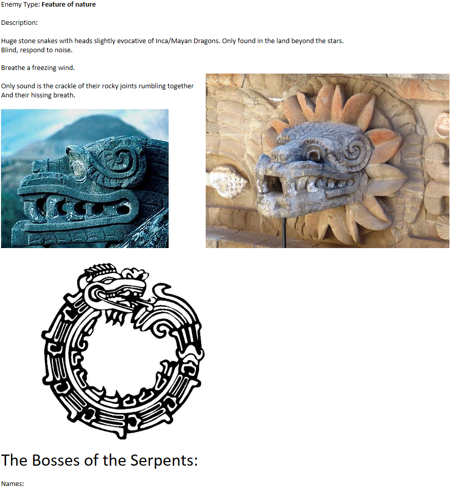

Serpents of the Deep

Enemy type: natural feature

Description:

Huge stone snakes with heads slightly evocative of Aztec Dragons. Only found adjacent to [The End/Nowhere](/p/a2ad74c520014a0c8070f22f5930797d).

Names:

**Causation**

**Dependent Origination**

Constant clicking crackling noise of their joints rubbing together. Different from how the [Witnesses](/p/71f7bbe694b74dde9a39c628cfc1e9ff) tick in time.

One serpent whispers: “Not yet time, not yet time, not yet time…”

The other whispers: "Not yet mine, not yet mine, not yet mine..."

The two are entwined in a figure eight.

They are megabossess of [The Deep](/p/ac458f6ea8e2410e9eddcdc79d5a90f7).
