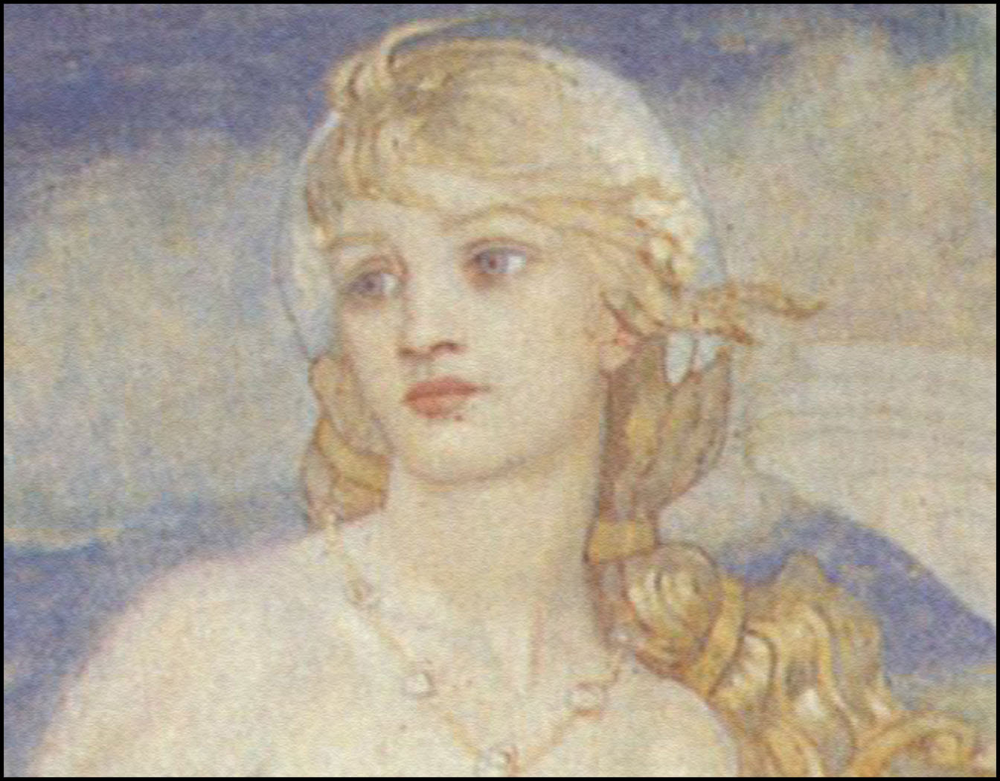

Enemy: Wandering Stars

Wandering Stars look like glittering stars from a distance (LOD trick), but close and they are pale people wielding gleaming/shining swords. They soar back and forth, a few feet above the ground. When they swing their swords, they shoot sparkling waves of starlight at you.

[High level (late game) messengers](/p/c604b20dab2a47a2a706563c64ef2470) have a Crown of seven(?) stars. Maybe [Sunset](/p/e86dde5ef894493cb5e1f93855b62c83) can get a crown of stars?

This entails them acting as bodyguards.

There are also burnt out stars.

They are full of darkness.

[Deep Space Messengers](/p/c604b20dab2a47a2a706563c64ef2470) fight these as well.

## References

[Deep Space (Ancient) Messengers](/p/c604b20dab2a47a2a706563c64ef2470)
[Story Roadmap (with scenes)](/p/64c71b1bfb2a4717a53593ce05b258f8)
[Sunset](/p/e86dde5ef894493cb5e1f93855b62c83)
[Permanence and Loss (playthroughs)](/p/1685a994ac7b4f0f9d79cad42388e2a4)
[Your Star](/p/8ea13698180a4c3a8c71d9ac4f956c5f)
