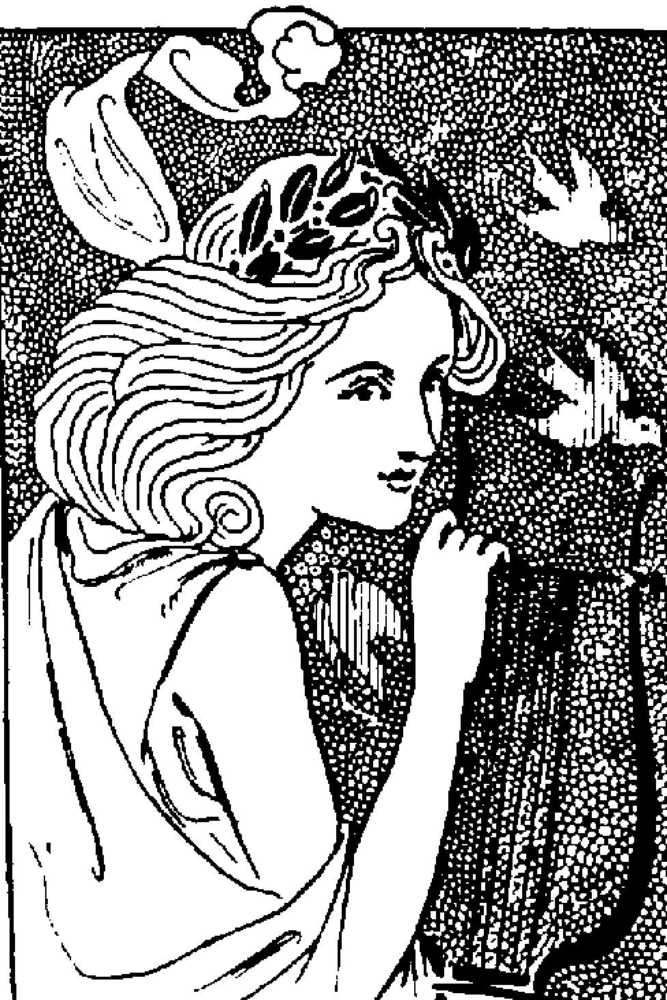
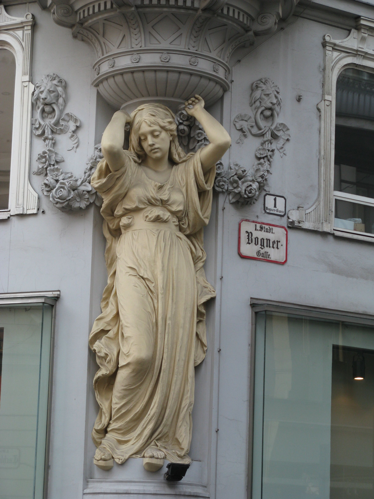

Silent poet who guides the PC through [The City/The Labyrinth of Lost Dreams](/p/10e73639c05f4ed1bc3262e2e8d8296c).

A tour guide / labyrinth guardian.

*Keeps a golden locket around her neck.* 

Her robe is a tattered American flag.

***

Municipal Poet of [the City](/p/10e73639c05f4ed1bc3262e2e8d8296c). White robes, laurel wreath. Found on a plinth. Statuesque; a living caryatid (comes as a surprise when they suddenly awaken in the players’ presence).

Indeterminate gender, like Krazy Kat. Mute, can only speak by gesturing to worn away signs in the environment.
She waves her hand and the right words light up on the plaques on the walls

“My brothers and sisters have gone away. But I miss them.”
One of the only survivors of the iconoclasm.

What would cause a statue to survive? Just chance.

You wake her by reading what is printed on her pediment. Brush away the dust

***

Speaking idea is too hackneyed.

Just has to be choked up, like Lucy, like everyone.

Maybe only speaks through text on local billboards… or **words spliced together from old recordings.**

Shodan did this. But they are LCD so she can rearrange advertisements.

Sort of like the ransom note font.

Maybe text before speech.

***

Intro Scene:

[Liberty Intro Scene](/p/2f62bbd2b17a461a945b98a63fd01175)

***

**Concept Art:**

## References

[Compelled by US iconography](/p/deedfbdd7bd44af9b68b7cd0e3f12fa2)
[Liberty](:/bea199e9de29402cbfd2fe23cadf35c9)
[The Weatherman](/p/626c245aa9f84338bbd35a3874186b8a)
[TODO List (SOS)](/p/4742b7c786aa444fb1e01144c78d2890)
[Loss 2](/p/a859aa673fa441adb3f85e88e5798245)
[Story Roadmap (with scenes)](/p/64c71b1bfb2a4717a53593ce05b258f8)
[Liberty](/p/f92b3507b1bf46cc81c6c04fb40efa41)
[Shade info… Shadows, Echoes, Ghosts, Shards](/p/da622103663d4fad8372a8769414cc25)
[Synopsis (another one)](/p/21d29c8fa11c46c3aeb6b26c29a1505e)
[Another Synopsis (top-down) \[best\]](/p/735c96da2df5451eb19b2b2a6b342e74)
[The City/The Labyrinth of Lost Dreams](/p/10e73639c05f4ed1bc3262e2e8d8296c)
[Word List / Categories](/p/193c4b3e6ea24170829178087aec70c1)
[Ideas and Images](/p/722c2fe9d13346b7824282338e7ca6e9)
[Old Summary](/p/355f63b2b1c84813a1b2eb2bbb2cf2bc)
