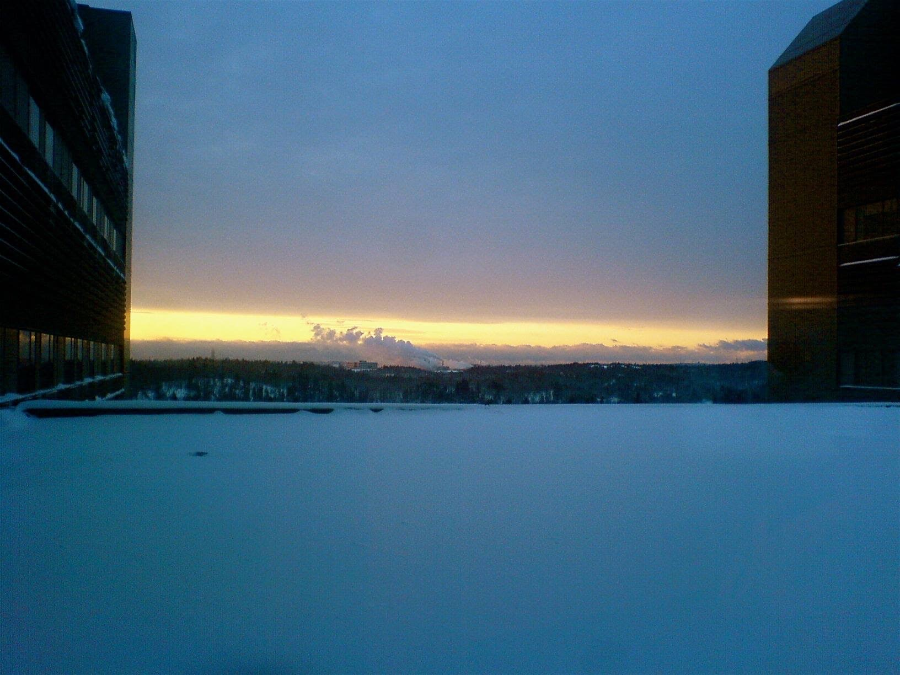

Buildings concept/mood art

Theme: “Zones without people” 
<https://youtu.be/PAKafYB5-6g>

Concept art

 

[^ Starbus](/p/e91ff4dce0f8469b803a6d314663f59c)

 

[Prison Planet](/p/fde64cac01824d63a685fa2cd4695b38)

