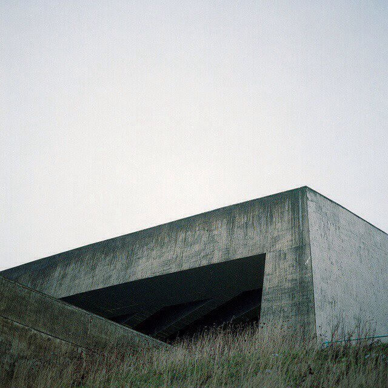
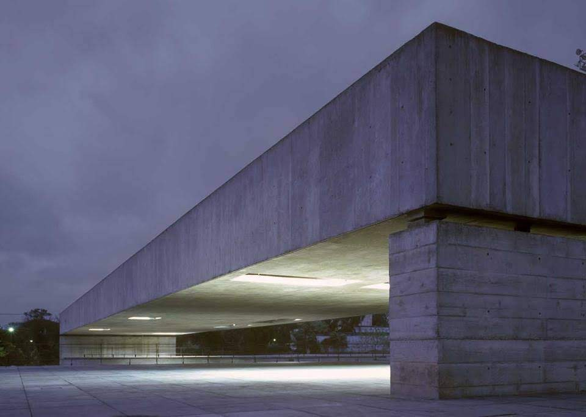
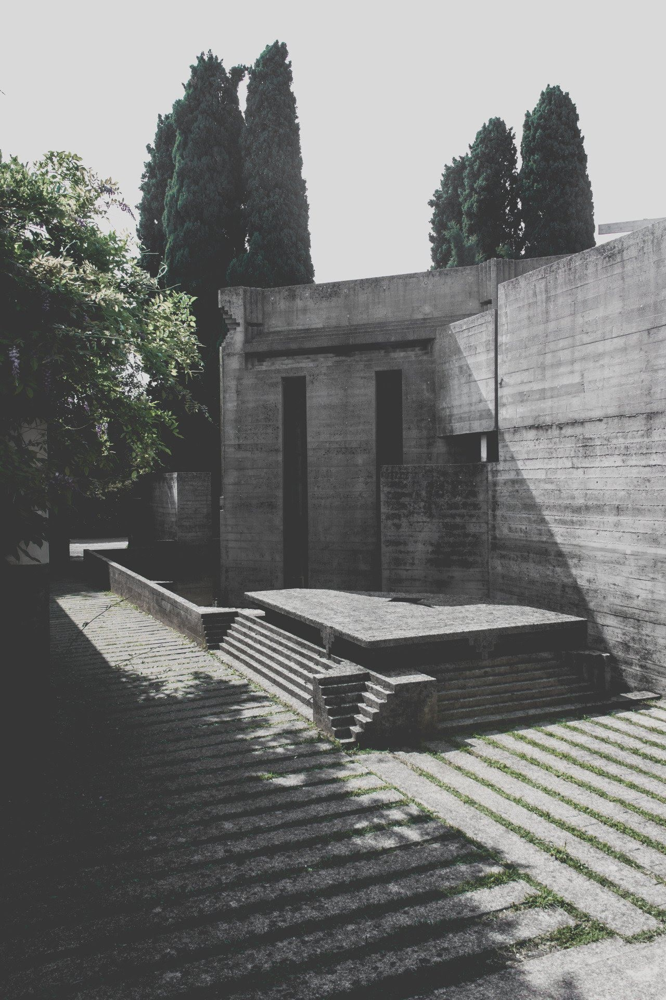
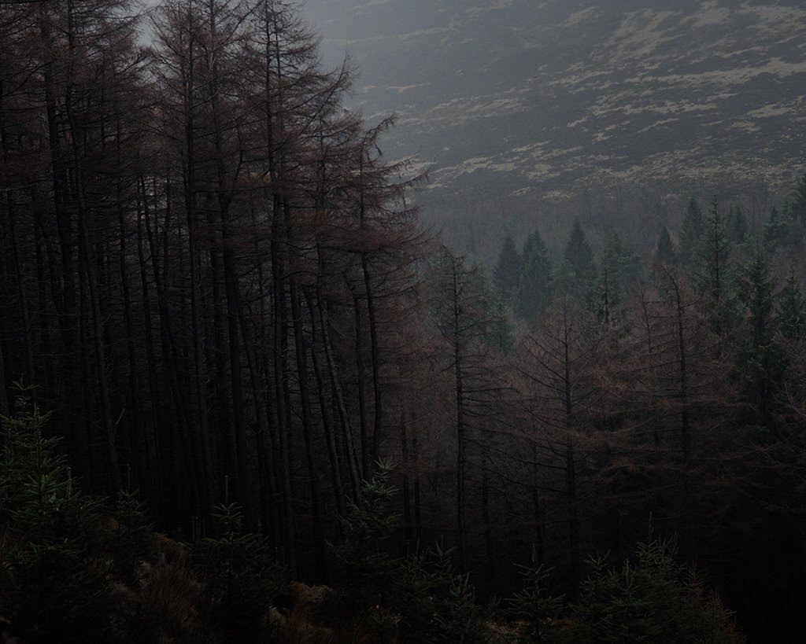
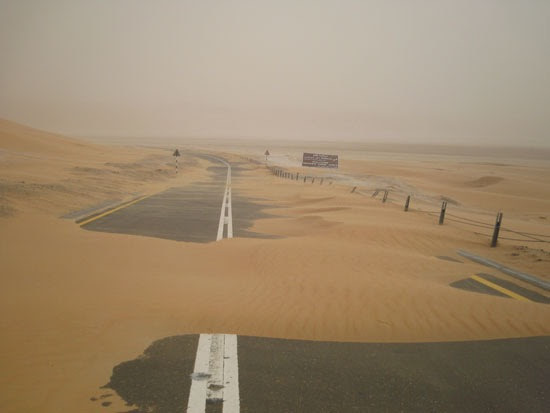

# **Prison** (starting planet)

This zone doubles as a tutorial area.

He is in a cell with a chain tied to his ankle. Next to him the wall is covered in those scratchmarks, though it’s unclear if they’re days or weeks or even years.

But if you are an ultimate gamer, you will succeed.

The prison is almost inaccessible. [Starbus](/p/e91ff4dce0f8469b803a6d314663f59c) service is spotty and infrequent. Most people in the empire don’t even know that the planet exists, let alone that there's a station here. It's been taken off the registry.

It was condemned because it was overrun with snakes, an invasive species which breeds like crazy in the hot weather.

[Lion](/p/2001b9b679ed4d8abbd8cfb46998773c) secretly hacks into it to take it off the blacklist to found the blacksite prison. But you have to enter the coordinates manually.

The prisoners think the planet is cursed.

Perhaps they're right.

**Prison Proper:**

Forest changes for mountainous desert. Don't go off the highway (although it's hard to follow the path).

## References

[Prison Scene](/p/c54aeb37bdc040898fb86193d769aecf)
[Story Roadmap (with scenes)](/p/64c71b1bfb2a4717a53593ce05b258f8)
[Buildings concept/mood art](/p/fb6b5900675c4d0fb13bb8d4c148b25c)
[The Graveyard](/p/8c61516daa304a7da75a31432d1c6e04)
[Prison and Warfighters](/p/9803e9de69264680811c8ed647a2d276)
[Waking the Dead](/p/6cc7332365c0412cbb4340975f6049b7)
[Resource Processing](/p/04e9737208bb49b3834df5c8cf687ab3)
[Brief Summary](/p/fee65c6bead3412cab91a0ef60fa45d4)
[Starbus](/p/e91ff4dce0f8469b803a6d314663f59c)
[Obnoxious Questions (used to flesh out the game) Annoying Questions FAQ](/p/0b6fa809714a4d62bc688da4979df27b)
[Attempts at an Elevator Pitch](/p/7712c363399c404b93897ad56e4418bc)
[Another Synopsis (top-down) \[best\]](/p/735c96da2df5451eb19b2b2a6b342e74)
[Story Thematics (Fairy Tale) (top-down)](/p/7e46cce45f5344249c6c2881b168e2ab)
[Lion](/p/2001b9b679ed4d8abbd8cfb46998773c)
[Synopsis (another one)](/p/21d29c8fa11c46c3aeb6b26c29a1505e)
[Old Summary](/p/355f63b2b1c84813a1b2eb2bbb2cf2bc)
